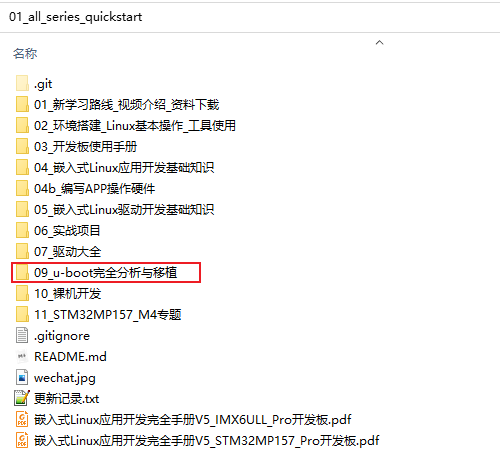
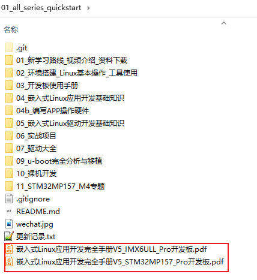

# 开发环境搭建

## 1. 下载资料

* 需要有百问网的IMX6ULL或STM32MP157开发板
  * IMX6ULL: https://item.taobao.com/item.htm?id=610613585935
  * STM32MP157:https://item.taobao.com/item.htm?id=623233533961

* 下载资料：
  * 打开http://download.100ask.net/，在左侧找到板子，下载"实验班配套资料"的网盘资料
  * 在上述网页中找到"快速入门"的GIT地址：https://e.coding.net/weidongshan/01_all_series_quickstart.git，只有GIT命令下载(不能在浏览器直接打开)。
    
* 按照https://www.bilibili.com/video/BV1XK411D7wK前5节视频，搭建好开发环境
* 加入QQ群：782400715

## 2. 编译u-boot

按照手册操作：

## 3. 大纲

大概内容如下：

* u-boot功能概述
  * 目的
  * 功能细分
* u-boot源码结构
* u-boot的配置、编译、连接过程
  * Makefile深入练习
  * 分析u-boot的Makefile
  * u-boot可执行程序的组成
* u-boot源码分析
  * SPL与第1阶段
  * 第2阶段
  * 核心：命令
  * 让u-boot的使用更加便利：env
* u-boot的设备树
* u-boot实战
  * 移植其他版本的u-boot
  * 修改设备树支持网卡

## 4. 参考资料

《嵌入式linux应用开发完全手册》

