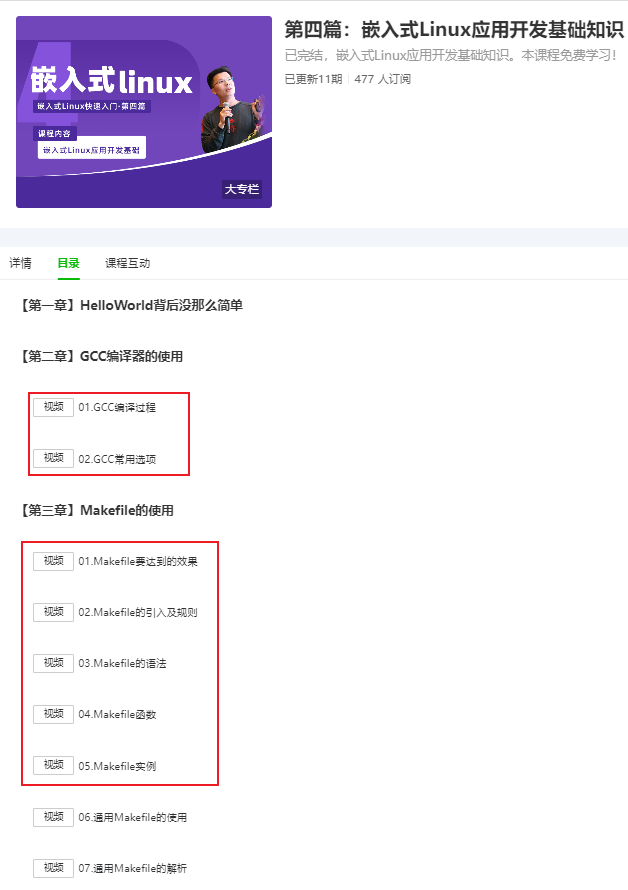
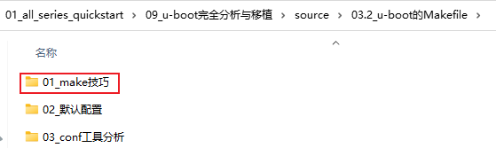
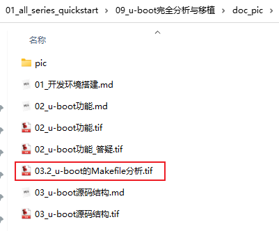
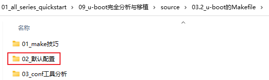
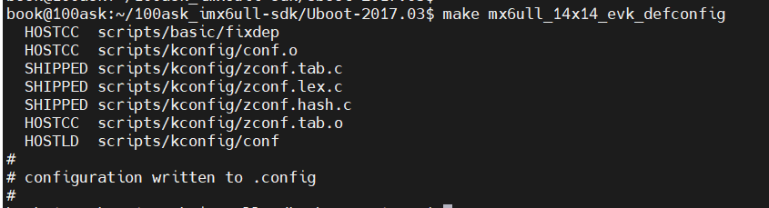
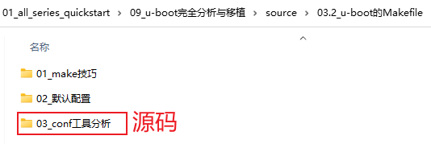
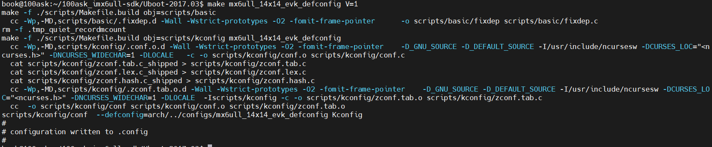
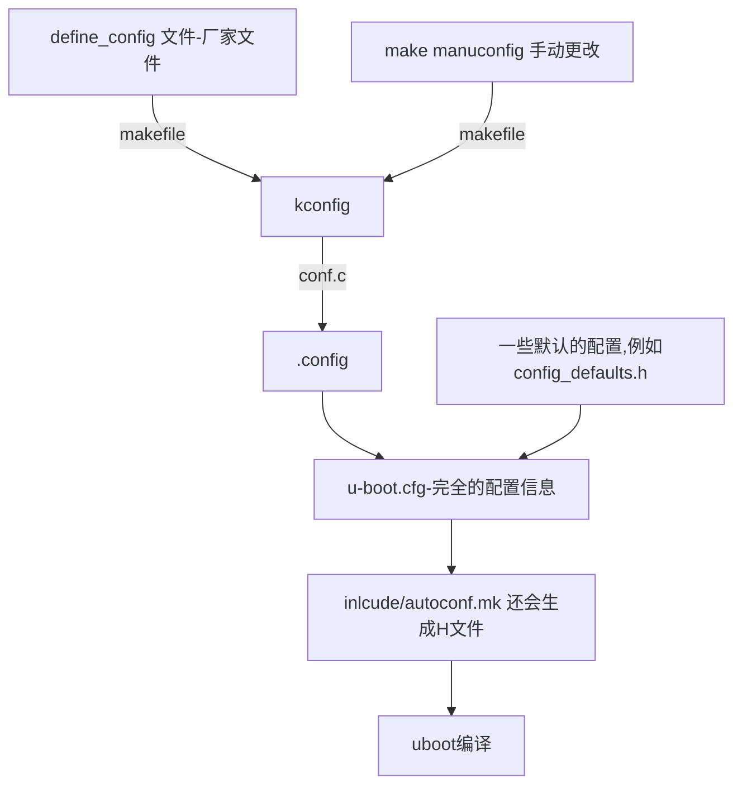

# 3. 配置u-boot的过程分析


## 3.1 源码结构

在u-boot目录下执行"tree  .  -d  > 1.txt"，可以得到目录的结构，精简如下：

```shell
├── arch    
│   ├── arm              // 1. 架构相关
│   │   ├── cpu
│   │   │   ├── armv7
│   │   │   │   ├── mx6
│   │   ├── dts
│   │   │   └── include
│   │   │       └── dt-bindings -> ../../../../include/dt-bindings
│   │   ├── include
│   │   │   ├── asm
│   │   │   │   ├── arch-imx
│   │   │   │   ├── arch-imx8
│   │   │   │   ├── arch-imx8m
│   │   │   │   ├── imx-common
│   │   │   └── debug
│   │   ├── lib
│   │   ├── mach-rockchip
│   │   │   ├── rk3036
│   │   │   ├── rk3288
│   │   │   └── rk3399
│   │   ├── lib
├── board             // 单板相关
│   ├── freescale
│   │   ├── common
│   │   │   └── p_corenet
│   │   ├── corenet_ds
│   │   ├── mx6ul_14x14_ddr3_arm2
│   │   ├── mx6ul_14x14_evk
│   │   ├── mx6ul_14x14_lpddr2_arm2
│   │   ├── mx6ull_ddr3_arm2
│   │   ├── mx6ullevk
├── cmd                   // 通用的命令
│   ├── fastboot
│   └── mvebu
├── common                // 通用的
│   ├── eeprom
│   ├── init
│   └── spl
├── configs
├── disk
├── drivers               // 各类驱动
├── fs                    // 文件系统
│   ├── cbfs
│   ├── cramfs
│   ├── ext4
│   ├── fat
│   ├── jffs2
│   ├── reiserfs
│   ├── sandbox
│   ├── ubifs
│   ├── yaffs2
│   └── zfs
├── include
├── lib                  // 库
├── net                  // 网络协议
```


## 3.2 Makefile分析

### 3.2.1 基础知识

文档：本Git仓库`01_all_series_quickstart\04_嵌入式Linux应用开发基础知识\doc_pic\04.2018_Makefile`

视频：




### 3.2.2 make的技巧

源码：



打印Makefile的规则和变量：`make -p`

可以把make命令规则和变量存入文件：`make -p > 1.txt`

然后执行`vi 1.txt`，使用vi命令删除注释：`:g/^#/d`

## 3.3 u-boot的默认配置

笔记对应的图片：



### 3.3.1 默认配置的过程

资料：



IMX6ULL: `make mx6ull_14x14_evk_defconfig`

STM32MP157: `make stm32mp15_trusted_defconfig `

执行过程：

* 制作工具：scripts/kconfig/conf
* 把默认配置信息写入文件".config"



分析过程：

```shell
mx6ull_14x14_evk_defconfig: scripts/kconfig/conf
	$(Q)$< $(silent) --defconfig=arch/$(SRCARCH)/configs/$@ $(Kconfig)
```

就是：

```shell
UBOOTVERSION=2017.03 scripts/kconfig/conf --defconfig=arch/../configs/mx6ull_14x14_evk_defconfig Kconfig
```

**分析上面的命令如何执行的，就需要分析config.c 文件**

```c
吃入Kconfig 输出.config 文件
```

### 3.3.2 conf命令概述

总体分析：scripts/kconfig/conf.c

源码：



更详细的配置过程：`make mx6ull_14x14_evk_defconfig V=1`

**这里V==1 能打印更多的信息**




```shell
defconfig_file = "arch/../configs/mx6ull_14x14_evk_defconfig";
name = "Kconfig"

conf_parse(name);  // 解析uboot根目录下的Kconfig文件

conf_read(defconfig_file); // 读配置文件

conf_set_all_new_symbols(def_default); // 设置new_symbols为默认值

conf_write(NULL); // 写到.config
```


* Kconfig：这是一个通用文件，里面规定了一些依赖，比如：
  * 如果是ARM架构，就默认选中A、B、C配置  `根据Kconifg的配置，默认选择一定的关联配置。`
  * 如果是RISC-V架构，就默认选中a、b、c配置
* defconfig_file：这是厂家提供的，里面定义了
  * ARM架构
  * 自己的一些配置项
* 怎么处理呢？
  * 使用defconfig_file的内容去解析Kconfig，确定各个依赖的配置项
  * 其他未涉及的配置项，给它们指定默认值
  * 写入.config


### 3.3.3 conf命令详解

深入分析：scripts/kconfig/conf.c `只从应用层去了解了。分析配置后的变化实验。`

源码：


## 4. 这些配置怎么被用起来？

最后生成的.config 有两个用法：

* 确定编译中有哪些文件被选择
* 生成H文件和C文件，在编译的时候会被用到。

所以整个的通路是怎么样子的？

* 执行make  XXX_define_config 会被/kconifg/conf.c 吃入后生.config文件，之后uboot 编译的时候会根据config.c的文件去添加编译依赖选项和生成H文件，最后参与编译生成uboot
* 由此，这就涉及到uboot 是如何处理的了？

路径图就是下面的关系：

.config也不是最终的版本信息，还需要结合其他的配置信息，才能实现最后所有的配置信息。



## 5. 编译的时候如何使用这些信息/


