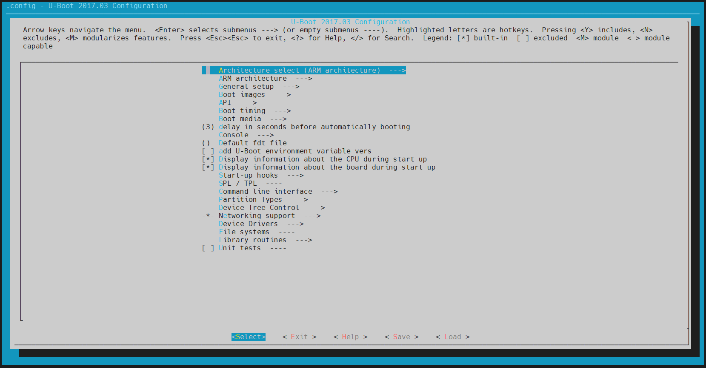
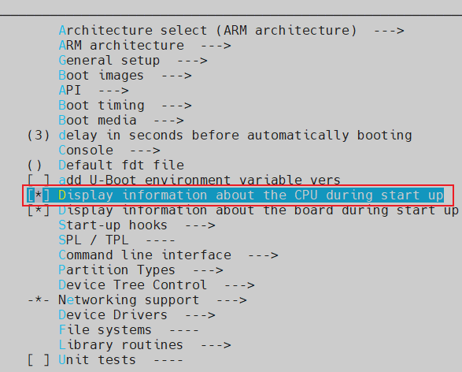
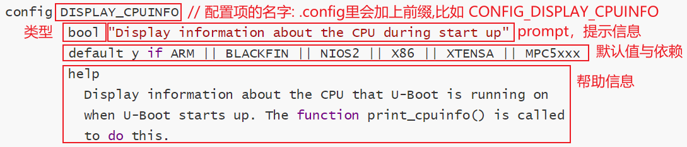
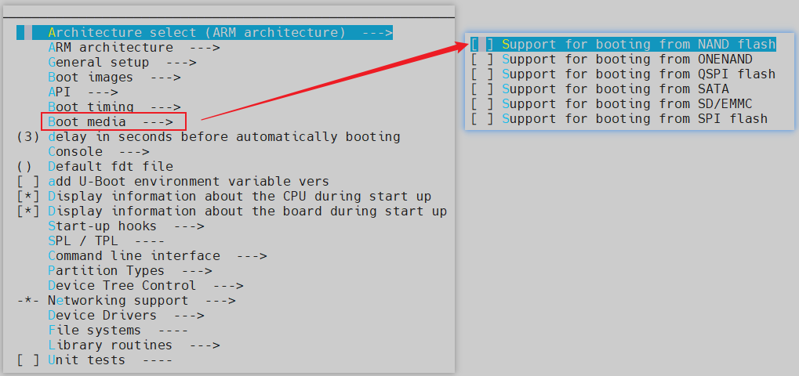
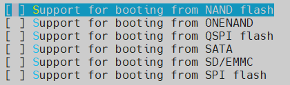
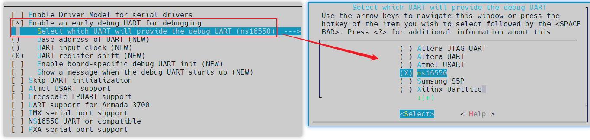
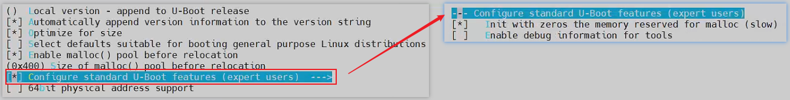
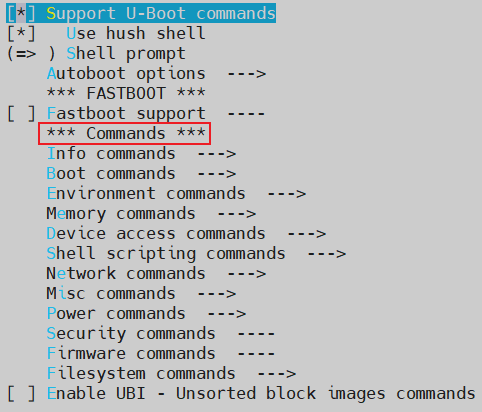

## Kconfig介绍

参考文档： **重点是Kconfig 的语法**

```
任一个Linux内核的Documentation\kbuild\kconfig-language.rst

https://www.rt-thread.org/document/site/programming-manual/kconfig/kconfig/
```

对于各类内核，只要支持menuconfig配置界面，都是使用**Kconfig**。
在配置界面中，可以选择、设置选项，这些设置会保存在.config文件里。
编译脚本会包含.config，根据里面的值决定编译哪些文件、怎么编译文件。
.config文件也会被转换为头文件，C程序可以从头文件中获得配置信息。

### 1.1 配置界面示例



问题：

* 这个界面里，各个配置项来自哪里
* 这个界面里，这些配置项是怎么组织的
* 这个界面里，我们的选择、设置，结果保存在哪里
* 这些配置结果，怎么使用

### 1.2 配置结果的保存

#### 1.2.1 示例

在配置界面中操作的结果保存在.config文件中，示例如下：

```
#
# Automatically generated file; DO NOT EDIT.
# U-Boot  Configuration
#
CONFIG_CREATE_ARCH_SYMLINK=y
# CONFIG_ARC is not set
CONFIG_ARM=y
# CONFIG_AVR32 is not set
# CONFIG_BLACKFIN is not set
# CONFIG_M68K is not set
# CONFIG_MICROBLAZE is not set
# CONFIG_MIPS is not set
# CONFIG_NDS32 is not set
# CONFIG_NIOS2 is not set
# CONFIG_OPENRISC is not set
# CONFIG_PPC is not set
# CONFIG_SANDBOX is not set
# CONFIG_SH is not set
# CONFIG_SPARC is not set
# CONFIG_X86 is not set
# CONFIG_XTENSA is not set
CONFIG_SYS_ARCH="arm"
CONFIG_SYS_CPU="armv7"
CONFIG_SYS_SOC="mx6"
CONFIG_SYS_VENDOR="freescale"
CONFIG_SYS_BOARD="mx6ullevk"
CONFIG_SYS_CONFIG_NAME="mx6ullevk"

#
# ARM architecture
#
CONFIG_HAS_VBAR=y
CONFIG_HAS_THUMB2=y
CONFIG_CPU_V7=y
CONFIG_SYS_ARM_ARCH=7
CONFIG_SYS_CACHE_SHIFT_6=y
CONFIG_SYS_CACHELINE_SIZE=64
```

编译脚本会包含.config文件，它会根据里面的变量比如`CONFIG_CPU_V7`选择u-boot特性。

#### 1.2.2 配置项的前缀

在Kconfig文件中，假设配置项的名字是XXX，在.config文件中：

* 默认情况下，它对应的变量名为`CONFIG_XXX`
* 如果设置了环境变量`CONFIG_=ABC`，则对应的变量名为`ABC_XXX`

  

### 1.3 描述单个配置项config

#### 1.3.1 示例

在`menuconfig`界面，可以看到这个配置项：



在配置界面，使用方向箭头游走到`Display information about the CPU during start up`后，可以：

* 输入Y，选择配置项，在.config中对应`CONFIG_DISPLAY_CPUINFO=y`

* 输入N，不选择配置项，在.config中对应`# CONFIG_DISPLAY_CPUINFO is not set`

  

上图中的配置项怎么实现的？
在common/Kconfig文件中，它对应下列代码：




#### 1.3.2 语法
上面是一个精简的例子，完整的例子可以从Linux中获得，如下：

```shell
config SGI_SNSC
        bool "SGI Altix system controller communication support"
        depends on (IA64_SGI_SN2 || IA64_GENERIC)
        default y
        help
          If you have an SGI Altix and you want to enable system
          controller communication from user space (you want this!),
          say Y.  Otherwise, say N.
```
解释如下：

* config
  表示`config option`，这是Kconfig的基本entry；其他entry是用来管理config的。
  config 表示一个配置选项的开始，紧跟着的 SGI_SNSC 是配置选项的名称。
  config 下面几行定义了该配置选项的属性。
  属性可以是该配置选项的：类型、输入提示、依赖关系、默认值、帮助信息。
  - bool 表示配置选项的类型，每个 config 菜单项都要有类型定义，变量有5种类型
    - bool 布尔类型
    - tristate 三态类型
    - string 字符串
    - hex 十六进制
    - int 整型
  - "SGI Altix system controller communication support"：提示信息
  - depends on：表示依赖关系，**只有(IA64_SGI_SN2 || IA64_GENERIC)被选中，才可以选择SGI_SNSC**
  - select XXX：表示反向依赖关系，即当前配置选项被选中后，`XXX`选项就会被选中。
  - default 表示配置选项的默认值，bool 类型的默认值可以是 y/n。
  - help 帮助信息，在`menuconfig`界面输入H键时，就会提示帮助信息。

### 1.4 实现菜单menu/endmenu

#### 1.4.1 示例

示例代码：`rt-smart/kernel/src/Kconfig`，代码如下：

```shell
menu "Boot media"

config NOR_BOOT
        bool "Support for booting from NOR flash"
        depends on NOR
        help
          Enabling this will make a U-Boot binary that is capable of being
          booted via NOR.  In this case we will enable certain pinmux early
          as the ROM only partially sets up pinmux.  We also default to using
          NOR for environment.

config NAND_BOOT
        bool "Support for booting from NAND flash"
        default n
        help
          Enabling this will make a U-Boot binary that is capable of being
          booted via NAND flash. This is not a must, some SoCs need this,
          some not.

config ONENAND_BOOT
        bool "Support for booting from ONENAND"
        default n
        help
          Enabling this will make a U-Boot binary that is capable of being
          booted via ONENAND. This is not a must, some SoCs need this,
          some not.

config QSPI_BOOT
        bool "Support for booting from QSPI flash"
        default n
        help
          Enabling this will make a U-Boot binary that is capable of being
          booted via QSPI flash. This is not a must, some SoCs need this,
          some not.

config SATA_BOOT
        bool "Support for booting from SATA"
        default n
        help
          Enabling this will make a U-Boot binary that is capable of being
          booted via SATA. This is not a must, some SoCs need this,
          some not.

config SD_BOOT
        bool "Support for booting from SD/EMMC"
        default n
        help
          Enabling this will make a U-Boot binary that is capable of being
          booted via SD/EMMC. This is not a must, some SoCs need this,
          some not.

config SPI_BOOT
        bool "Support for booting from SPI flash"
        default n
        help
          Enabling this will make a U-Boot binary that is capable of being
          booted via SPI flash. This is not a must, some SoCs need this,
          some not.

endmenu

```

界面如下：



#### 1.4.2 语法

解释如下：

* menu "xxx"表示一个菜单，菜单名是"xxx"

* menu和endmenu之间的entry都是"xxx"菜单的选项

* 在上面的例子中子菜单有6个选项：

  

  


### 1.5 实现单选choice/endchoice

#### 1.5.1 示例

示例代码：`rt-smart/kernel/src/Kconfig`，代码如下：

```shell
config DEBUG_UART
        bool "Enable an early debug UART for debugging"
        help
          The debug UART is intended for use very early in U-Boot to debug
          problems when an ICE or other debug mechanism is not available.

choice
        prompt "Select which UART will provide the debug UART"
        depends on DEBUG_UART
        default DEBUG_UART_NS16550

config DEBUG_UART_ALTERA_JTAGUART
        bool "Altera JTAG UART"
        help
          Select this to enable a debug UART using the altera_jtag_uart driver.
          You will need to provide parameters to make this work. The driver will
          be available until the real driver model serial is running.

config DEBUG_UART_ALTERA_UART
        bool "Altera UART"
        help
          Select this to enable a debug UART using the altera_uart driver.
          You will need to provide parameters to make this work. The driver will
          be available until the real driver model serial is running.

endchoice
```

界面如下：




在上述界面中，设置了`DEBUG_UART`，才有后续的"选择菜单"。


#### 1.5.2 语法

解释如下：

* choice表示"选择"
* choice和endchoice之间的entry是可以选择的项目
  * 它们之间，只能有一个被设置为"y"：表示编进内核
  * 它们之间，可以设置多个为"m"：表示编译为模块
  * 比如一个硬件有多个驱动程序
    * 同一时间只能有一个驱动能编进内核
    * 但是多个驱动都可以单独编译为模块


### 1.6 menuconfig

`menuconfig XXX`和`config XXX`类似，
唯一不同的是该选项除了能设置y/m/n外，还可以实现菜单效果(**能回车进入该项内部**)。

#### 1.6.1 示例

示例代码：`Kconfig`

```shell
menuconfig EXPERT
        bool "Configure standard U-Boot features (expert users)"
        default y
        help
          This option allows certain base U-Boot options and settings
          to be disabled or tweaked. This is for specialized
          environments which can tolerate a "non-standard" U-Boot.
          Use this only if you really know what you are doing.

if EXPERT
        config SYS_MALLOC_CLEAR_ON_INIT
        bool "Init with zeros the memory reserved for malloc (slow)"
        default y
        help
          This setting is enabled by default. The reserved malloc
          memory is initialized with zeros, so first malloc calls
          will return the pointer to the zeroed memory. But this
          slows the boot time.

          It is recommended to disable it, when CONFIG_SYS_MALLOC_LEN
          value, has more than few MiB, e.g. when uses bzip2 or bmp logo.
          Then the boot time can be significantly reduced.
          Warning:
          When disabling this, please check if malloc calls, maybe
          should be replaced by calloc - if one expects zeroed memory.

config TOOLS_DEBUG
        bool "Enable debug information for tools"
        help
          Enable generation of debug information for tools such as mkimage.
          This can be used for debugging purposes. With debug information
          it is possible to set breakpoints on particular lines, single-step
          debug through the source code, etc.

endif # EXPERT

```

界面如下：




#### 1.6.2 语法

menuconfig常用格式有2种：

```shell
  menuconfig M
  if M
      config C1
      config C2
  endif
```

或：

```shell
  menuconfig M
  config C1
      depends on M
  config C2
      depends on M
```

第1项`menuconfig M`跟`config M`语法是一样的，
不同之处在于`menuocnfig M`后面可以跟着好几个依赖于M的`config C1`、`config C2`等子配置项。

### 1.7 if/endif

#### 1.7.1 语法

在上面的menuconfig中就有`if/endif`的使用，它的语法如下：

```shell
"if" <expr>
<if block>
"endif"
```

#### 1.7.2 示例

示例如下，只有定义了的EXPERT项，`SYS_MALLOC_CLEAR_ON_INIT`等才会显示出来：

```shell
if EXPERT
        config SYS_MALLOC_CLEAR_ON_INIT
        bool "Init with zeros the memory reserved for malloc (slow)"
        default y
        help
          This setting is enabled by default. The reserved malloc
          memory is initialized with zeros, so first malloc calls
          will return the pointer to the zeroed memory. But this
          slows the boot time.

          It is recommended to disable it, when CONFIG_SYS_MALLOC_LEN
          value, has more than few MiB, e.g. when uses bzip2 or bmp logo.
          Then the boot time can be significantly reduced.
          Warning:
          When disabling this, please check if malloc calls, maybe
          should be replaced by calloc - if one expects zeroed memory.

config TOOLS_DEBUG
        bool "Enable debug information for tools"
        help
          Enable generation of debug information for tools such as mkimage.
          This can be used for debugging purposes. With debug information
          it is possible to set breakpoints on particular lines, single-step
          debug through the source code, etc.

endif # EXPERT
```

### 1.8 source

source 语句用于读取另一个文件中的 Kconfig 文件，
比如`Kconfig`中就包含了其他Kconfig：

```shell
source "arch/Kconfig"
```

### 1.9 comment 

comment 语句出现在界面的第一行，用于定义一些提示信息，如`cmd/Kconfig`：

```shell
comment "Commands"
```

界面如下：


### 1.10 测试代码

==下述的内容都是放到K config 里面，然后利用menu config 配置。==

#### 1.10.1 config

```shell
config 100ASK
        bool "test for 100ask"
        default y
        help
          just for Kconfig test
```


#### 1.10.2 menu(多选)

```shell
menu "100ASK menu"

config IMX6ULL_TEST
        tristate "menu test item 1 IMX6ULL"
        help
          just for test menu.

config STM32MP157_TEST
        tristate "menu test item 2 IMX6ULLh"
        help
          just for test menu.
endmenu
```


#### 1.10.3 choice(单选)

```shell
config CHOICE_ON_100ASK
        bool "Enable choice for 100ask"
        help
          Enable choice for 100ask

choice
        prompt "choice test for 100ask"
        depends on CHOICE_ON_100ASK			/*加一个依赖*/

config CHOICE_ITEM1
        bool "CHOICE_ITEM1"
        help
          CHOICE_ITEM1.

config CHOICE_ITEM2
        bool "CHOICE_ITEM2"
        help
          CHOICE_ITEM2.

endchoice
```


#### 1.10.4 menuconfig

```c
menuconfig 100ASK_MENUCFG				/* menuconfig 后面跟的是一个变量,需要先被选中 */
         bool "test for menuconfig of 100ask"

if 100ASK_MENUCFG
config IMX6ULL_TEST_MENUCFG
        tristate "menuconfig test item 1 IMX6ULL"
        help
          just for test menuconfig.

config STM32MP157_MENUCFG
        tristate "menuconfig test item 2 IMX6ULLh"
        help
          just for test menuconfig.
endif
              
/* 没有end menu */              
```


```c
menu "test menu"	/*menu后面是一个提示信息，不需要选择，进入menu*/
config TEST_A
    bool "TEST A"
    default y
    
config TEST_B
    bool "TEST B"
    default y

endmenu

choice
        prompt "test choise"
        default TEST_C

config TEST_C
    bool "TEST C"
    default y
    
config TEST_D
    bool "TEST D"
    default y

endchoice        

menuconfig TEST_MENUCONFIG
    bool "test menuconfig"
    default n
    
if TEST_MENUCONFIG
config TEST_E
    bool "TEST E"
    default y

config TEST_F
    bool "TEST F"
    default y


endif
```


## 2. 这些配置怎么被用起来？

最后生成的.config 有两个用法：

* 确定编译中有哪些文件被选择
* 生成H文件和C文件，在编译的时候会被用到。

所以整个的通路是怎么样子的？

* 执行make  XXX_define_config 会被/kconifg/conf.c 吃入后生.config文件，之后uboot 编译的时候会根据config.c的文件去添加编译依赖选项和生成H文件，最后参与编译生成uboot
* 由此，这就涉及到uboot 是如何处理的了？


