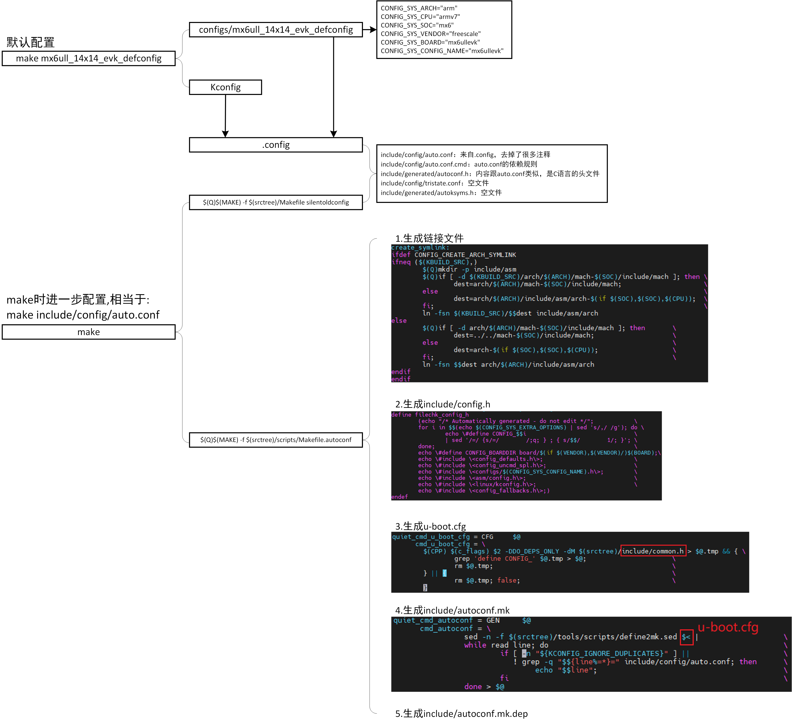
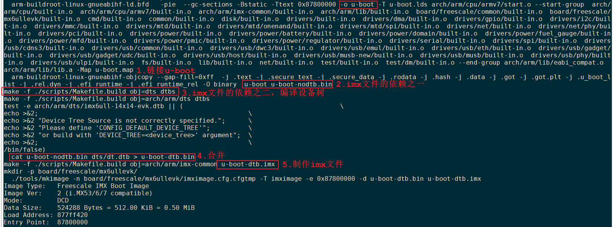
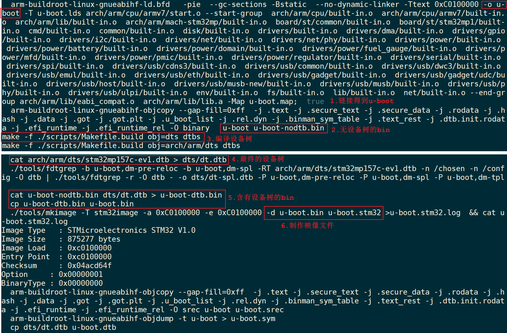

# 5. 编译uboot的过程分析


## 5.1 体验

```shell
IMX6ULL: 
make mx6ull_14x14_evk_defconfig
make

STM32MP157: 
make stm32mp15_trusted_defconfig
make
```


make过程

* 检查、更新头文件，比如include/config.h 、u-boot.cfg 。会根据.config 生成不同的头文件，例如有`#define Config_A 1`


* 制作工具
* 交叉编译**如何根据kconfig来决定编译哪些文件呢？**
  * 编译哪些目录、哪些文件？ `drivers/makefile` makefile 只会处理`obj-y`的模块，结合makefile 写法：`obj-$(CONFIG_NXP_GPIO) +=NXP_gpio.o` 就可以在需要使用对应驱动的时候，使能：`CONFIG_NXP_GPIO`
  * .c文件可能需要使用.config的配置值，它可以引用config.h


* 例如文件系统中的makefile:

  * `obj-y += fat/`  一定编译的
  * `obj-$(conifg_JFFS) += jffs2/` 选择性编译的子文件夹，同时在`jffs2/`的文件夹下面的makefile中也有下面的代码：

  ```c
  obj-y += a.o //一定会编译的
  obj-$(conifg_sort) += sort.o // 只有选择了conifg_sort的选项才会编译。
  ```

* 由此obj有以下四种写法：

  ```c
  obj-y += xxxx/				/*一定编译的两种写法 目录-文件*/
  obj-y += yyyy.o
  obj-$(config_xxx) += xxxx/	 /* 配置编译的两种写法*/
  obj-$(config_yyyy)+= yyy.o
  ```

  


## 5.2 配置过程详细分析

参考资料：https://www.cnblogs.com/jianhua1992/archive/2022/11/02/16852774.html


### 5.2.1 Makefile的精简代码

```shell
PHONY := _all
_all:

_all: all

KCONFIG_CONFIG	?= .config

# 定义一些常用变量
# 比如
# build := -f $(srctree)/scripts/Makefile.build obj
include scripts/Kbuild.include

# 定义交叉编译工具链
CC		= $(CROSS_COMPILE)gcc

-include include/config/auto.conf
-include include/config/auto.conf.cmd
$(KCONFIG_CONFIG) include/config/auto.conf.cmd: ;

include/config/%.conf: $(KCONFIG_CONFIG) include/config/auto.conf.cmd
	$(Q)$(MAKE) -f $(srctree)/Makefile silentoldconfig
	$(Q)$(MAKE) -f $(srctree)/scripts/Makefile.autoconf || \
		{ rm -f include/config/auto.conf; false; }
	$(Q)touch include/config/auto.conf

-include include/autoconf.mk
-include include/autoconf.mk.dep

# 里面又包含架构相关、CPU相关的文件
# sinclude $(srctree)/arch/$(ARCH)/config.mk      # include architecture dependend rules
# sinclude $(srctree)/$(CPUDIR)/config.mk         # include  CPU  specific rules
include config.mk

# 架构相关参数、相关文件、库
# head-y := arch/arm/cpu/$(CPU)/start.o
# libs-y += arch/arm/cpu/$(CPU)/
include arch/$(ARCH)/Makefile  

# 确定链接脚本
ifndef LDSCRIPT
	ifeq ($(wildcard $(LDSCRIPT)),)
		LDSCRIPT := $(srctree)/board/$(BOARDDIR)/u-boot.lds
	endif
	ifeq ($(wildcard $(LDSCRIPT)),)
		LDSCRIPT := $(srctree)/$(CPUDIR)/u-boot.lds
	endif
	ifeq ($(wildcard $(LDSCRIPT)),)
		LDSCRIPT := $(srctree)/arch/$(ARCH)/cpu/u-boot.lds
	endif
endif

# 默认要处理的库的路径
libs-y += lib/
libs-$(HAVE_VENDOR_COMMON_LIB) += board/$(VENDOR)/common/
libs-$(CONFIG_OF_EMBED) += dts/
libs-y += fs/
libs-y += net/
libs-y += disk/
libs-y += drivers/

# 取决于配置的库的路径
libs-$(CONFIG_FMAN_ENET) += drivers/net/fm/
libs-$(CONFIG_SYS_FSL_DDR) += drivers/ddr/fsl/
libs-$(CONFIG_SYS_FSL_MMDC) += drivers/ddr/fsl/
libs-$(CONFIG_ALTERA_SDRAM) += drivers/ddr/altera/

u-boot-init := $(head-y)
u-boot-main := $(libs-y)

u-boot-dirs	:= $(patsubst %/,%,$(filter %/, $(libs-y))) tools examples

$(sort $(u-boot-init) $(u-boot-main)): $(u-boot-dirs) ;

$(u-boot-dirs): prepare scripts
	$(Q)$(MAKE) $(build)=$@

# all目标要生成的依赖
ALL-y += u-boot.srec u-boot.bin u-boot.sym System.map binary_size_check

all:		$(ALL-y)

u-boot.hex u-boot.srec: u-boot FORCE
        $(call if_changed,objcopy)

u-boot:	$(u-boot-init) $(u-boot-main) u-boot.lds FORCE
	$(call if_changed,u-boot__)
ifeq ($(CONFIG_KALLSYMS),y)
	$(call cmd,smap)
	$(call cmd,u-boot__) common/system_map.o
endif
```


上课时临时精简出来的Makefile：

```shell
ifeq ($(KBUILD_SRC),)


# That's our default target when none is given on the command line
PHONY := _all
_all:

endif # ifeq ($(KBUILD_SRC),)

# We process the rest of the Makefile if this is the final invocation of make
ifeq ($(skip-makefile),)

PHONY += all
_all: all

HOSTCC       = cc

# Decide whether to build built-in, modular, or both.
# Normally, just do built-in.

KBUILD_MODULES :=
KBUILD_BUILTIN := 1

# 引入很多变量, 
# 比如:
# build := -f $(srctree)/scripts/Makefile.build obj
include scripts/Kbuild.include

# 定义交叉编译工具链
AS		= $(CROSS_COMPILE)as
CC		= $(CROSS_COMPILE)gcc
CPP		= $(CC) -E


version_h := include/generated/version_autogenerated.h
timestamp_h := include/generated/timestamp_autogenerated.h

no-dot-config-targets := clean clobber mrproper distclean \
			 help %docs check% coccicheck \
			 ubootversion backup tests

config-targets := 0
mixed-targets  := 0
dot-config     := 1


ifeq ($(mixed-targets),1)
else
ifeq ($(config-targets),1)
else
PHONY += scripts
scripts: scripts_basic include/config/auto.conf
	$(Q)$(MAKE) $(build)=$(@)

ifeq ($(dot-config),1)
-include include/config/auto.conf
-include include/config/auto.conf.cmd
# To avoid any implicit rule to kick in, define an empty command
$(KCONFIG_CONFIG) include/config/auto.conf.cmd: ;

# If .config is newer than include/config/auto.conf, someone tinkered
# with it and forgot to run make oldconfig.
# if auto.conf.cmd is missing then we are probably in a cleaned tree so
# we execute the config step to be sure to catch updated Kconfig files
include/config/%.conf: $(KCONFIG_CONFIG) include/config/auto.conf.cmd
	$(Q)$(MAKE) -f $(srctree)/Makefile silentoldconfig
	@# If the following part fails, include/config/auto.conf should be
	@# deleted so "make silentoldconfig" will be re-run on the next build.
	$(Q)$(MAKE) -f $(srctree)/scripts/Makefile.autoconf || \
		{ rm -f include/config/auto.conf; false; }
	@# include/config.h has been updated after "make silentoldconfig".
	@# We need to touch include/config/auto.conf so it gets newer
	@# than include/config.h.
	@# Otherwise, 'make silentoldconfig' would be invoked twice.
	$(Q)touch include/config/auto.conf

-include include/autoconf.mk
-include include/autoconf.mk.dep

```


### 5.2.2 配置文件进一步处理

前面生成了.config，但是它不是最终版本的配置文件。

顶层Makefile会包含2个配置文件：include/config/auto.conf、include/autoconf.mk。

u-boot中有非常多的配置文件：

* .config：来自单板的默认配置、Kconfig

* include/config/auto.conf：来自.config，去掉了很多注释

* u-boot.cfg：它的内容跟头文件类似，来自

  * .config

  * 头文件include/common.h，又包含了"#include <config.h>"，config.h内容如下:

    ```c
    /* Automatically generated - do not edit */
    #define CONFIG_IMX_CONFIG       board/freescale/mx6ullevk/imximage.cfg
    #define CONFIG_BOARDDIR board/freescale/mx6ullevk
    #include <config_defaults.h>
    #include <config_uncmd_spl.h>
    #include <configs/mx6ullevk.h>
    #include <asm/config.h>
    #include <linux/kconfig.h>
    #include <config_fallbacks.h>
    ```

* include/autoconf.mk：来自u-boot.cfg，但是移除include/config/auto.conf的内容以免重复


需要进一步处理：

```shell
include/config/%.conf: $(KCONFIG_CONFIG) include/config/auto.conf.cmd
	$(Q)$(MAKE) -f $(srctree)/Makefile silentoldconfig
	$(Q)$(MAKE) -f $(srctree)/scripts/Makefile.autoconf || \
		{ rm -f include/config/auto.conf; false; }
	$(Q)touch include/config/auto.conf
```

上述规则的命令里，有2个操作：

```shell
$(Q)$(MAKE) -f $(srctree)/Makefile silentoldconfig
$(Q)$(MAKE) -f $(srctree)/scripts/Makefile.autoconf
```


第1个操作相当于：make silentoldconfig，生成了文件

* include/config/auto.conf：来自.config，去掉了很多注释
* include/config/auto.conf.cmd：auto.conf的依赖规则
* include/generated/autoconf.h：内容跟auto.conf类似，是C语言的头文件
* include/config/tristate.conf：空文件
* include/generated/autoksyms.h：空文件

```shell
make silentoldconfig

%config: scripts_basic outputmakefile FORCE
        $(Q)$(MAKE) $(build)=scripts/kconfig $@

进入scripts/kconfig是它的Makefile: 
silentoldconfig: $(obj)/conf
        $(Q)mkdir -p include/config include/generated
        $(Q)test -e include/generated/autoksyms.h || \
            touch   include/generated/autoksyms.h
        $< $(silent) --$@ $(Kconfig)

scripts/kconfig/conf分析：
scripts/kconfig/conf  --silentoldconfig Kconfig
1. sync_kconfig = 1
2. name = "Kconfig", conf_parse(name);
3. name = conf_get_configname(); = ".config"
4. conf_read(NULL);  # 
```


第2个操作相当于`make -f scripts/Makefile.autoconf`，会生成一系列头文件：

* `ln -fsn arch-mx6 arch/arm/include/asm/arch`
* include/autoconf.mk, {spl,tpl}/include/autoconf.mk
* include/config.h


`scripts/Makefile.autoconf`分析：

```shell
__all: include/autoconf.mk include/autoconf.mk.dep

include include/config/auto.conf
include scripts/Kbuild.include

CC              = $(CROSS_COMPILE)gcc
CPP             = $(CC) -E

include config.mk

include/autoconf.mk.dep: include/config.h FORCE
        $(call cmd,autoconf_dep)

u-boot.cfg: include/config.h FORCE
        $(call cmd,u_boot_cfg)

include/autoconf.mk: u-boot.cfg
        $(call cmd,autoconf)

include/config.h: scripts/Makefile.autoconf create_symlink FORCE
        $(call filechk,config_h)

create_symlink:
ifdef CONFIG_CREATE_ARCH_SYMLINK
ifneq ($(KBUILD_SRC),)
        $(Q)mkdir -p include/asm
        $(Q)if [ -d $(KBUILD_SRC)/arch/$(ARCH)/mach-$(SOC)/include/mach ]; then \
                dest=arch/$(ARCH)/mach-$(SOC)/include/mach;                     \
        else                                                                    \
                dest=arch/$(ARCH)/include/asm/arch-$(if $(SOC),$(SOC),$(CPU));  \
        fi;                                                                     \
        ln -fsn $(KBUILD_SRC)/$$dest include/asm/arch
else
        $(Q)if [ -d arch/$(ARCH)/mach-$(SOC)/include/mach ]; then       \
                dest=../../mach-$(SOC)/include/mach;                    \
        else                                                            \
                dest=arch-$(if $(SOC),$(SOC),$(CPU));                   \
        fi;                                                             \
        ln -fsn $$dest arch/$(ARCH)/include/asm/arch
endif
endif
```


### 5.2.3 配置过程总结



## 5.3 编译过程详细分析(IMX6ULL)

### 5.3.1 结论

以IMX6ULL为例，先说结论：



细节如下：

* 执行make命令时，要编译得到哪些文件由`ALL-y`决定

  * 规则如下

    ```shell
    include config.mk              # 里面会包含arch/arm/config.mk(含有ALL-y += u-boot-dtb.imx)
    
    _all : all
    
    # Always append ALL so that arch config.mk's can add custom ones
    ALL-y += u-boot.srec u-boot.bin u-boot.sym System.map binary_size_check
    
    ALL-$(CONFIG_OF_SEPARATE) += u-boot.dtb
    
    all:            $(ALL-y)
    ```
  
  * `ALL-y`的值为：
  
    ```shell
    checkarmreloc u-boot-dtb.imx u-boot.srec u-boot.bin u-boot.sym System.map binary_size_check u-boot.dtb
    ```
  
    


* u-boot-dtb.imx依赖于u-boot-dtb.bin，u-boot-dtb.bin又依赖于u-boot-nodtb.bin和dts/dt.dtb

* 各类u-boot文件都依赖于u-boot，先编译得到u-boot，它由`u-boot-init`、`u-boot-main`两部分链接而成

  * u-boot-init为：arch/arm/cpu/armv7/start.o

  * u-boot-main为：lib/built-in.o  fs/built-in.o  net/built-in.o 等等

  * 如何编译各个built-in.o，以lib/built-in.o为例

    * 执行: ``make -f ./scripts/Makefile.build obj=lib`
    * 会包含lib/Makefile，里面定义了`obj-y`
    * 使用Makefile.build的规则把各个obj-y编译、链接为built-in.o

  * 使用如下的命令链接得到u-boot：

    ```shell
    quiet_cmd_u-boot__ ?= LD      $@
          cmd_u-boot__ ?= $(LD) $(LDFLAGS) $(LDFLAGS_u-boot) -o $@ \
          -T u-boot.lds $(u-boot-init)                             \
          --start-group $(u-boot-main) --end-group                 \
          $(PLATFORM_LIBS) -Map u-boot.map
    ```

* 再编译得到设备树文件: `make -f ./scripts/Makefile.build obj=dts dtbs`

  * 顶层Makefile如下：

    ```shell
  dts/dt.dtb: checkdtc u-boot
      $(Q)$(MAKE) $(build)=dts dtbs
    ```
    
  * scripts/Makefile.build中，会包含 dts/Makefile
  
    ```shell
    DTB := arch/$(ARCH)/dts/$(DEVICE_TREE).dtb
    
    $(DTB): arch-dtbs
    $(obj)/dt.dtb: $(DTB) FORCE
          $(call if_changed,shipped)
    targets += dt.dtb
    
    $(DTB): arch-dtbs
    	  $(Q)test -e $@ || (                                             \
    	  echo >&2;                                                       \
    	  echo >&2 "Device Tree Source is not correctly specified.";      \
    	  echo >&2 "Please define 'CONFIG_DEFAULT_DEVICE_TREE'";          \
    	  echo >&2 "or build with 'DEVICE_TREE=<device_tree>' argument";  \
    	  echo >&2;                                                       \
    	  /bin/false)
    
    arch-dtbs:
    	  $(Q)$(MAKE) $(build)=arch/$(ARCH)/dts dtbs
    
    .SECONDARY: $(obj)/dt.dtb.S
    
    obj-$(CONFIG_OF_EMBED) := dt.dtb.o
    
    dtbs: $(obj)/dt.dtb
    	  @:
    ```
  
   
  
* 最后把u-boot、设备树打包: `make -f ./scripts/Makefile.build obj=arch/arm/imx-common u-boot-dtb.imx`

  ```shell
  include config.mk              # 里面会包含arch/arm/config.mk(含有ALL-y += u-boot-dtb.imx)
  
  %.imx: %.bin
        $(Q)$(MAKE) $(build)=arch/arm/imx-common $@
  ```
  
  

### 5.3.2 顶层Makefile

顶层Makefile里：

* 包含架构相关的Makefile，里面指定了第1个文件（head-y）
* 指定了要编译哪些子目录（libs-y）。

从顶层Makefile开始分析：

```shell
include config.mk              # 里面会包含arch/arm/config.mk(含有ALL-y += u-boot-dtb.imx)
include arch/$(ARCH)/Makefile  # arch/arm/Makefile, 里面含有head-y libs-y

libs-y += lib/
libs-$(HAVE_VENDOR_COMMON_LIB) += board/$(VENDOR)/common/
libs-$(CONFIG_OF_EMBED) += dts/
libs-y += fs/
libs-y += net/
libs-y += disk/
libs-y += drivers/
libs-y += drivers/dma/
libs-y += drivers/gpio/
libs-y += drivers/i2c/
libs-y += drivers/mmc/

libs-y += $(if $(BOARDDIR),board/$(BOARDDIR)/)

libs-y := $(sort $(libs-y))

u-boot-dirs     := $(patsubst %/,%,$(filter %/, $(libs-y))) tools examples

u-boot-alldirs  := $(sort $(u-boot-dirs) $(patsubst %/,%,$(filter %/, $(libs-))))

libs-y          := $(patsubst %/, %/built-in.o, $(libs-y))

u-boot-init := $(head-y)
u-boot-main := $(libs-y)

ALL-y += u-boot.srec u-boot.bin u-boot.sym System.map binary_size_check
```


对于`arch/arm/Makefile`：

```shell
head-y := arch/arm/cpu/$(CPU)/start.o

libs-y += arch/arm/cpu/$(CPU)/
libs-y += arch/arm/cpu/
libs-y += arch/arm/lib/
```


所以，顶层Makefile包含了`arch/arm/Makefile`，确定了head-y为`arch/arm/cpu/armv7/start.o`。

还定义了libs-y变量，它里面含有多个目录。


### 5.3.3 编译子目录

顶层Makefile里定义了libs-y，会进入里面每一目录，使用它的Makefile进行编译：

```shell
u-boot-main := $(libs-y)

$(sort $(u-boot-init) $(u-boot-main)): $(u-boot-dirs) ;  # 对$(u-boot-init) $(u-boot-main)排序

u-boot-dirs     := $(patsubst %/,%,$(filter %/, $(libs-y))) tools examplesc # 对$(libs-y) 的含义进行过滤，防止有误写的情况

$(u-boot-dirs): prepare scripts
# 其实就是用Makefile.build对对应的目录进行编译。
        # make -f $(srctree)/scripts/Makefile.build obj=arch/arm/cpu/arm7
        $(Q)$(MAKE) $(build)=$@   
```


比如：u-boot-main里面含有一个目录"arch/arm/cpu/armv7/"，在u-boot-dirs中它末尾的"/"被取消，就变成：arch/arm/cpu/armv7。

然后使用scripts/Makefile.build进行处理：$(Q)$(MAKE) $(build)=$@ ，展开就是：

```shell
make -f scripts/Makefile.build obj=arch/arm/cpu/armv7/
```

scripts/Makefile.build是编译u-boot源码的关键：

```shell
src := $(patsubst $(prefix)/%,%,$(obj))  # obj=arch/arm/cpu/arm7/, src=arch/arm/cpu/armv7

# 第1个目标  很重要，会递归调用不同编译好的文件
__build:

# The filename Kbuild has precedence over Makefile
kbuild-dir := $(if $(filter /%,$(src)),$(src),$(srctree)/$(src))
kbuild-file := $(if $(wildcard $(kbuild-dir)/Kbuild),$(kbuild-dir)/Kbuild,$(kbuild-dir)/Makefile)
include $(kbuild-file)  # 包含 arch/arm/cpu/arm7/Makefile

ifneq ($(strip $(lib-y) $(lib-m) $(lib-)),)
lib-target := $(obj)/lib.a  # 如果包含的arch/arm/cpu/armv7/Makefile里定义了lib-y
endif

ifneq ($(strip $(obj-y) $(obj-m) $(obj-) $(subdir-m) $(lib-target)),)
builtin-target := $(obj)/built-in.o # 如果包含的arch/arm/cpu/armv7/Makefile里定义了obj-y
endif


__build: $(if $(KBUILD_BUILTIN),$(builtin-target) $(lib-target) $(extra-y)) \
         $(if $(KBUILD_MODULES),$(obj-m) $(modorder-target)) \
         $(subdir-ym) $(always)
        @:


# Built-in and composite module parts
$(obj)/%.o: $(src)/%.c $(recordmcount_source) FORCE
        $(call cmd,force_checksrc)
        $(call if_changed_rule,cc_o_c)
        

ifdef builtin-target
quiet_cmd_link_o_target = LD      $@
# If the list of objects to link is empty, just create an empty built-in.o
cmd_link_o_target = $(if $(strip $(obj-y)),\
                      $(LD) $(ld_flags) -r -o $@ $(filter $(obj-y), $^) \
                      $(cmd_secanalysis),\
                      rm -f $@; $(AR) rcs$(KBUILD_ARFLAGS) $@)

$(builtin-target): $(obj-y) FORCE
        $(call if_changed,link_o_target)

targets += $(builtin-target)
endif # builtin-target
```


### 5.3.4 链接得到u-boot

顶层Makefile里：

```shell
libs-y          := $(patsubst %/, %/built-in.o, $(libs-y))

u-boot-init := $(head-y)
u-boot-main := $(libs-y)

# Rule to link u-boot
# May be overridden by arch/$(ARCH)/config.mk
quiet_cmd_u-boot__ ?= LD      $@
      cmd_u-boot__ ?= $(LD) $(LDFLAGS) $(LDFLAGS_u-boot) -o $@ \
      -T u-boot.lds $(u-boot-init)                             \
      --start-group $(u-boot-main) --end-group                 \
      $(PLATFORM_LIBS) -Map u-boot.map

quiet_cmd_smap = GEN     common/system_map.o
cmd_smap = \
        smap=`$(call SYSTEM_MAP,u-boot) | \
                awk '$$2 ~ /[tTwW]/ {printf $$1 $$3 "\\\\000"}'` ; \
        $(CC) $(c_flags) -DSYSTEM_MAP="\"$${smap}\"" \
                -c $(srctree)/common/system_map.c -o common/system_map.o

u-boot: $(u-boot-init) $(u-boot-main) u-boot.lds FORCE
        $(call if_changed,u-boot__)
ifeq ($(CONFIG_KALLSYMS),y)
        $(call cmd,smap)
        $(call cmd,u-boot__) common/system_map.o
endif
```

就是把head-y和各个libs-y下的built-in.o链接得到u-boot。


### 5.3.5 映像文件的依赖

对于IMX6ULL，要使用的是u-boot-dtb.imx，它含有u-boot和设备树。

在顶层Makefile里：

```shell
include config.mk              # 里面会包含arch/arm/config.mk(含有ALL-y += u-boot-dtb.imx)

%.imx: %.bin
        $(Q)$(MAKE) $(build)=arch/arm/imx-common $@
```

u-boot-dtb.imx依赖于u-boot-dtb.bin，u-boot-dtb.bin又依赖于u-boot-nodtb.bin和dts/dt.dtb。

在顶层Makefile里：

```shell
u-boot-dtb.bin: u-boot-nodtb.bin dts/dt.dtb FORCE
        $(call if_changed,cat)
        #cmd_cat  = cat $(filter-out $(PHONY),$^) > $@

u-boot-nodtb.bin: u-boot FORCE
        $(call if_changed,objcopy)
        $(call DO_STATIC_RELA,$<,$@,$(CONFIG_SYS_TEXT_BASE))
        $(BOARD_SIZE_CHECK)
```

所以，编译出u-boot后，会先制作u-boot-nodtb.bin；然后编译dts/dt.dtb；最后生成u-boot-dtb.bin、imx文件：


### 5.3.6 编译设备树

顶层Makefile里：

```shell
dts/dt.dtb: checkdtc u-boot
	  # make -f $(srctree)/scripts/Makefile.build obj=dts  dtbs
      $(Q)$(MAKE) $(build)=dts dtbs
```

需要用到scripts/Makefile.build中，它会包含 dts/Makefile， dts/Makefile中含有dtbs目标：

```shell
DEVICE_TREE ?= $(CONFIG_DEFAULT_DEVICE_TREE:"%"=%)
DTB := arch/$(ARCH)/dts/$(DEVICE_TREE).dtb # 就是 arch/arm/dts/imx6ull-14x14-evk.dtb

$(obj)/dt.dtb: $(DTB) FORCE
        $(call if_changed,shipped)

targets += dt.dtb

$(DTB): arch-dtbs
        $(Q)test -e $@ || (                                             \
        echo >&2;                                                       \
        echo >&2 "Device Tree Source is not correctly specified.";      \
        echo >&2 "Please define 'CONFIG_DEFAULT_DEVICE_TREE'";          \
        echo >&2 "or build with 'DEVICE_TREE=<device_tree>' argument";  \
        echo >&2;                                                       \
        /bin/false)


# $(srctree)/scripts/Makefile.build obj=arch/ARM/dts  dtbs
arch-dtbs:
        $(Q)$(MAKE) $(build)=arch/$(ARCH)/dts dtbs

.SECONDARY: $(obj)/dt.dtb.S

obj-$(CONFIG_OF_EMBED) := dt.dtb.o

dtbs: $(obj)/dt.dtb #目标实现。
        @:
```


最后会使用`$(Q)$(MAKE) $(build)=arch/$(ARCH)/dts dtbs`来处理，进入：使用arch/arm/dts/Makefile，里面定了dtb-y：

```shell
dtb-$(CONFIG_MX6) += imx6ul-14x14-ddr3-arm2.dtb \
        imx6ul-14x14-ddr3-arm2-emmc.dtb \
        imx6ul-14x14-ddr3-arm2-gpmi-weim.dtb \
        imx6ul-14x14-lpddr2-arm2.dtb \
        imx6ul-14x14-evk.dtb \
        imx6ul-14x14-evk-emmc.dtb \

PHONY += dtbs
dtbs: $(addprefix $(obj)/, $(dtb-y))
        @:
```


要编译出各类dtb文件，用到scripts/Makefile.lib，规则如下：

```shell
quiet_cmd_dtc = DTC     $@
# Modified for U-Boot
# Bring in any U-Boot-specific include after the '/dts-v1/;' header
cmd_dtc = mkdir -p $(dir ${dtc-tmp}) ; \
        cat $< $(if $(u_boot_dtsi),\
                | sed '/^\/ {$$/{x;s%$$%\#include \"$(u_boot_dtsi)\"%;G;}') | \
                $(CPP) $(dtc_cpp_flags) -x assembler-with-cpp -o $(dtc-tmp) - ; \
        $(DTC) -O dtb -o $@ -b 0 \
                -i $(dir $<) $(DTC_FLAGS) \
                -d $(depfile).dtc.tmp $(dtc-tmp) ; \
        cat $(depfile).pre.tmp $(depfile).dtc.tmp > $(depfile)

$(obj)/%.dtb: $(src)/%.dts FORCE
        $(call if_changed_dep,dtc)
```


### 5.3.7 制作映像文件

当制作出设备树文件后，在顶层Makefile里有如下规则，进而制作出u-boot-dtb.bin：

```shell
u-boot-dtb.bin: u-boot-nodtb.bin dts/dt.dtb FORCE
        $(call if_changed,cat)
```


回到顶层Makefile，看看如何制作imx映像文件：

```shell
include config.mk              # 里面会包含arch/arm/config.mk(含有ALL-y += u-boot-dtb.imx)

%.imx: %.bin
        $(Q)$(MAKE) $(build)=arch/arm/imx-common $@
```

现在u-boot-dtb.imx的依赖文件u-boot-dtb.bin已经生成了，将会使用arch/arm/imx-common/Makefile来生产imx文件：

```shell
u-boot.imx: u-boot.bin $(IMX_CONFIG) $(PLUGIN).bin FORCE
        $(call if_changed,mkimage)
```

最后会使用如下命令生产imx映像文件：

```shell
./tools/mkimage -n board/freescale/mx6ullevk/imximage.cfg.cfgtmp -T imximage -e 0x87800000 -d u-boot-dtb.bin u-boot-dtb.imx
```


## 5.4 配置编译过程(STM32MP157)

使用如下命令配置、编译STM32MP157的u-boot：

```shell
make stm32mp15_trusted_defconfig
make
```

所涉及的配置过程、编译过程，跟前面分析的IMX6ULL几乎一样。


### 5.4.1 配置过程总结

顶层Makefile会包含2个配置文件：include/config/auto.conf、include/autoconf.mk。

u-boot中有非常多的配置文件：

* .config：来自单板的默认配置、Kconfig

* include/config/auto.conf：来自.config，去掉了很多注释

* u-boot.cfg：它的内容跟头文件类似，来自

  * .config

  * 头文件include/common.h，又包含了"#include <config.h>"，config.h内容如下:

    ```c
    /* Automatically generated - do not edit */
    #define CONFIG_BOARDDIR board/st/stm32mp1
    #include <config_defaults.h>
    #include <config_uncmd_spl.h>
    #include <configs/stm32mp1.h>
    #include <asm/config.h>
    #include <linux/kconfig.h>
    #include <config_fallbacks.h>
    ```

* include/autoconf.mk：来自u-boot.cfg，但是移除include/config/auto.conf的内容以免重复


### 5.4.2 编译过程总结



结论：

* 执行make命令时，要编译得到哪些文件由`ALL-y`决定

  * 规则如下

    ```shell
    include config.mk              # 里面会包含arch/arm/config.mk
                                   # arch/arm/Makefile又包含$(machdirs)/config.mk
                                   # 就是包含 arch/arm/mach-stm32mp/config.mk
                                   # 里面有 ALL-y += u-boot.stm32
    
    _all : all
    
    # Always append ALL so that arch config.mk's can add custom ones
    ALL-y += u-boot.srec u-boot.bin u-boot.sym System.map binary_size_check
    
    ALL-$(CONFIG_OF_SEPARATE) += u-boot.dtb
    
    all:            $(ALL-y)
    ```

  * `ALL-y`的值为：

    ```shell
    checkarmreloc u-boot.stm32 u-boot.srec u-boot.bin u-boot.sym System.map binary_size_check u-boot.dtb
    ```

    


* u-boot.stm32依赖于u-boot.bin

  * u-boot.bin依赖于u-boot-dtb.bin
    * u-boot-dtb.bin依赖于u-boot-nodtb.bin和dts/dt.dtb

* 各类u-boot文件都依赖于u-boot，先编译得到u-boot，它由`u-boot-init`、`u-boot-main`两部分链接而成

  * u-boot-init为：arch/arm/cpu/armv7/start.o

  * u-boot-main为：lib/built-in.o  fs/built-in.o  net/built-in.o 等等

  * 如何编译各个built-in.o，以lib/built-in.o为例

    * 执行: ``make -f ./scripts/Makefile.build obj=lib`
    * 会包含lib/Makefile，里面定义了`obj-y`
    * 使用Makefile.build的规则把各个obj-y编译、链接为built-in.o

  * 使用如下的命令链接得到u-boot：

    ```shell
    quiet_cmd_u-boot__ ?= LD      $@
          cmd_u-boot__ ?= $(LD) $(LDFLAGS) $(LDFLAGS_u-boot) -o $@ \
          -T u-boot.lds $(u-boot-init)                             \
          --start-group $(u-boot-main) --end-group                 \
          $(PLATFORM_LIBS) -Map u-boot.map
    ```

* 再编译得到设备树文件: `make -f ./scripts/Makefile.build obj=dts dtbs`

  * 顶层Makefile如下：

    ```shell
    dts/dt.dtb: checkdtc u-boot
          $(Q)$(MAKE) $(build)=dts dtbs
    ```

  * scripts/Makefile.build中，会包含 dts/Makefile

    ```shell
    DTB := arch/$(ARCH)/dts/$(DEVICE_TREE).dtb
    
    $(DTB): arch-dtbs
    $(obj)/dt.dtb: $(DTB) FORCE
            $(call if_changed,shipped)
    
    targets += dt.dtb
    
    $(DTB): arch-dtbs
            $(Q)test -e $@ || (                                             \
            echo >&2;                                                       \
            echo >&2 "Device Tree Source is not correctly specified.";      \
            echo >&2 "Please define 'CONFIG_DEFAULT_DEVICE_TREE'";          \
            echo >&2 "or build with 'DEVICE_TREE=<device_tree>' argument";  \
            echo >&2;                                                       \
            /bin/false)
    
    arch-dtbs:
            $(Q)$(MAKE) $(build)=arch/$(ARCH)/dts dtbs
    
    .SECONDARY: $(obj)/dt.dtb.S
    
    obj-$(CONFIG_OF_EMBED) := dt.dtb.o
    
    dtbs: $(obj)/dt.dtb
            @:
    ```

    

* 最后制作u-boot.stm32，在arch/arm/mach-stm32mp/config.mk中有如下规则：

  ```shell
  u-boot.stm32: u-boot.bin FORCE
          $(call if_changed,mkimage)
  ```

  * if_changed函数在scripts/Kbuild.include中定义：

    ```shell
    if_changed = $(if $(strip $(any-prereq) $(arg-check)),                       \
            @set -e;                                                             \
            $(echo-cmd) $(cmd_$(1));                                             \
            printf '%s\n' 'cmd_$@ := $(make-cmd)' > $(dot-target).cmd)
    ```

  * 展开`$(call if_changed,mkimage)`，就是执行如下命令：

    ```shell
    cmd_mkimage
    ```

  * cmd_mkimage命令在顶层Makefile中定义：

    ```shell
    cmd_mkimage = $(objtree)/tools/mkimage $(MKIMAGEFLAGS_$(@F)) -d $< $@ \
    ```

    

