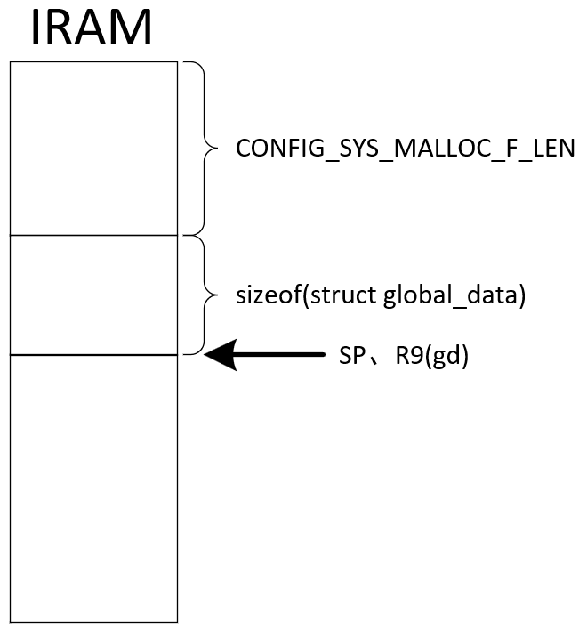

# 6. u-boot代码分析

## 6.1 启动过程概述

参考资料：https://blog.csdn.net/zhoutaopower/article/details/123133291

BootROM、SPL、u-boot等概念，重定位等概念。

### 6.1.1 XIP的概念

* 一上电，CPU必定从XIP设备得到第1条指令，并且执行一定是在**XIP设备**
* 号称支持Nand启动、支持SD卡启动、支持USB启动、支持UART启动的芯片，里面必定有BootROM【前面设备都不是xip 设备】
  * BootROM：硬件初始化、把程序从非XIP设备复制进RAM，从RAM里执行


### 6.1.2 BootROM的作用

BootROM：硬件初始化、把程序从非XIP设备复制进RAM，从RAM里执行

如何支持多种启动方式（SD卡、EMMC、USB、UART启动）

* 方法1：芯片有boot pin，决定使用哪个外设。bootrom根据引脚决定读取哪个设备的程序
* 方法2：芯片有boot pin，决定多种外设的尝试顺序
  * 示例顺序1：SD、EMMC、USB
  * 示例顺序2：EMMC、SD、USB
  * 示例顺序3：USB


### 6.1.3 完整的u-boot复制进内存

BootROM被用来启动用户程序，用户程序可能有几百KB、几MB，但是片内的RAM只有几KB：	

* 方法1：
  * BootROM从启动设备读取用户程序的前几KB到SRAM，运行它；
  * 这前几KB的代码负责：初始化DDR、把完整的程序从启动设备复制到DDR、并跳到DDR运行
* 方法2：
  * BootROM从启动设备读取SPL到SRAM，运行它；
  * SPL负责：初始化DDR、把用户程序从启动设备复制到DDR、并跳到DDR运行


### 6.1.4 重定位的2种方法

相对寻址、绝对寻址


重定位有2种方法：

* 程序当前位于地址A，但是它的链接地址是B，把它从A复制到B
* 程序当前位于地址A，想把它复制到B
  * 把它从A复制到B
  * 修改程序，把里面使用到的地址都重新为基于B的新地址


## 6.2 U-Boot的两个阶段

u-boot的源码大致可以分为2个阶段：

* board_init_f：f的意思是"running from read-only flash"
  * 作用：初始化硬件（比如DDR、UART），为各个功能预留内存（比如U-boot、Framebuffer、设备树）
* board_init_r：r的意思是"relocated"，意思是重定位过了
  * 作用：初始化各个子系统（各个存储设备、环境变量、网络），进入main_loop


### 6.2.1 board_init_f

board_init_f函数的本意是在Flash上执行，程序的数据段并未被复制到内存，也没有清除BSS段。它以及它调用的子函数都不能使用全局变量、静态变量。有些芯片以上电，内置的BROM会把U-Boot复制到内存，对于这种情况，我们也把它当作仍然在Flash上运行，仍然不能使用全局变量、静态变量。

board_init_f函数是C函数，调用它之前要设置栈。并且board_init_f函数里可能会调用malloc之类的堆函数：

* 堆内存在哪？可以从栈里划分出来
* 在哪里记录堆的基地址？继续在栈里划分区域用来保存一个`gd_t`结构体，在这个结构体里记录堆地址
* 怎么访问`gd_t`结构体？它的地址记录在r9寄存器里

在调用board_init_f之前，先调用board_init_f_alloc_reserve等函数，过程如下：


查看board_init_f_alloc_reserve函数，可以知道第1阶段的内存使用情况如下：




设置好global_data的指针，设置好栈后，_main函数调用board_init_f函数。而board_init_f函数的核心是调用init_sequence_f数组里的各个函数：


init_sequence_f数组内容如下：


board_init_f函数最大的作用就是为各个功能预留了内存，比如重定位后的U-boot放在哪里？Framebuffer、设备树放在哪里？

它先确定DDR的内存范围，然后从上往下划分内存。

这些信息记录在global_data里：

```CQL
// setup_mon_len
gd->mon_len = (ulong)&__bss_end - (ulong)_start;  /* u-boot.bin的大小 */

// fdtdec_setup
gd->fdt_blob = (ulong *)&_end;

// initf_malloc
gd->malloc_limit = CONFIG_SYS_MALLOC_F_LEN;
gd->malloc_ptr = 0;

// dram_init
gd->ram_size = imx_ddr_size();

// setup_dest_addr
	gd->ram_size = board_reserve_ram_top(gd->ram_size);
#ifdef CONFIG_SYS_SDRAM_BASE
	gd->ram_top = CONFIG_SYS_SDRAM_BASE;
#endif
	gd->ram_top += get_effective_memsize();
	gd->ram_top = board_get_usable_ram_top(gd->mon_len);
	gd->relocaddr = gd->ram_top;

// reserve_logbuffer
gd->relocaddr -= LOGBUFF_RESERVE;

// reserve_uboot
	gd->relocaddr -= gd->mon_len;
	gd->relocaddr &= ~(4096 - 1);
#ifdef CONFIG_E500
	/* round down to next 64 kB limit so that IVPR stays aligned */
	gd->relocaddr &= ~(65536 - 1);
#endif

	debug("Reserving %ldk for U-Boot at: %08lx\n", gd->mon_len >> 10,
	      gd->relocaddr);

	gd->start_addr_sp = gd->relocaddr;


// reserve_malloc
gd->start_addr_sp = gd->start_addr_sp - TOTAL_MALLOC_LEN;

// reserve_board
gd->start_addr_sp -= sizeof(bd_t);
gd->bd = (bd_t *)map_sysmem(gd->start_addr_sp, sizeof(bd_t));
memset(gd->bd, '\0', sizeof(bd_t));

// reserve_global_data
gd->start_addr_sp -= sizeof(gd_t);
gd->new_gd = (gd_t *)map_sysmem(gd->start_addr_sp, sizeof(gd_t));

// reserve_fdt
gd->fdt_size = ALIGN(fdt_totalsize(gd->fdt_blob) + 0x1000, 32);

gd->start_addr_sp -= gd->fdt_size;
gd->new_fdt = map_sysmem(gd->start_addr_sp, gd->fdt_size);

// reserve_stacks
gd->start_addr_sp -= 16;
gd->start_addr_sp &= ~0xf;
```


### 6.2.2 board_init_r