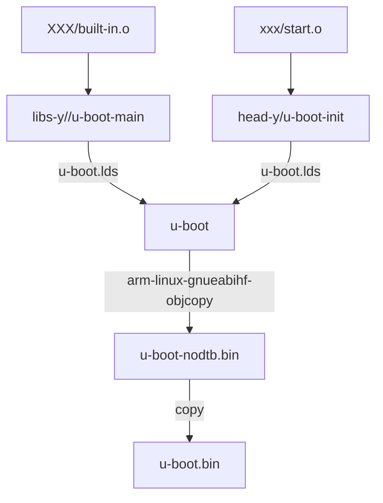

# 从头理清uboot（1）-makefile 分析

[toc]

## 1.简单介绍及背景

u-boot 的作用及背景：初始化外设、下载代码、搬运执行、boot kernel。（这个有很多解释了，就不再过多解释了^ - ^）

## 2. makefile分析

### 2.1 执行make mx6ull_14x14_ddr512_emmc_defconfig 之后会发生什么？

在uboot的编译中，我们会先利用`make mx6ull_14x14_ddr512_emmc_defconfig`类似指令去生成一个默认的`.config`文件，之后uboot 会根据这个`.config`文件编译成`uboot.bin`。

执行这个命令，在顶层makefile中会有下面这个规则和其匹配，可以看出其依赖于scripts_basic  outputmakefile FORCE 这三个变量。

```makefile
%config: scripts_basic outputmakefile FORCE
	$(Q)$(MAKE) $(build)=scripts/kconfig $@
```

其中需要处理的变量分别如下：

##### 1. scripts_basic  :

```makefile
scripts_basic:
	$(Q)$(MAKE) $(build)=scripts/basic
	$(Q)rm -f .tmp_quiet_recordmcount
```

​	分析其中几个变量的初始化值：

  1. `$(Q)`在开头有如下定义，其中`$(origin V)`是判断V 的来源是不是输入的`command line`。在编译config 的时候，我们没有定义`v`于是`KBUILD_VERBOSE =0`进而quiet 和Q 都不是空

     * 会有什么影响：在makefile中 @ 和 quiet_ 都是用于抑制输出。**加载命令行前就不会输出对应的makefile命令行**

     ```makefile
     ifeq ("$(origin V)", "command line")
       KBUILD_VERBOSE = $(V)
     endif
     ifndef KBUILD_VERBOSE
       KBUILD_VERBOSE = 0
     endif
     ifeq ($(KBUILD_VERBOSE),1)
       quiet =
       Q =
     else
       quiet=quiet_
       Q = @
     endif
     ```

		2.  `$(make)` 一般为对应的make 指令,为make 或者gmake.
		
		3.  `$(build)` buiild 在顶层makefile 没有被调用，在`scripts/Kbuild.include`的文件中有定义如下：

      ```makefile
      ###
      # Shorthand for $(Q)$(MAKE) -f scripts/Makefile.build obj=
      # Usage:
      # $(Q)$(MAKE) $(build)=dir
      build := -f $(srctree)/scripts/Makefile.build obj
      ```

      那么有以下问题：

      * 怎么会包含这个Kbuild.include？ R: 因为主makefile 包含了这个文件：`include scripts/Kbuild.include`。

      * $(srctree)的值是多少？R:见下面的makefile语法，由于变量`KBUILD_SRC`没有被定义，所以`srctree := .`，其中`:=`  表示立即赋值，在尽显赋值时机会被计算展开，否则采用`=`时，只会在使用时展开。

        ```makefile
        ifeq ($(KBUILD_SRC),)
                # building in the source tree
                srctree := . 
        else
                ifeq ($(KBUILD_SRC)/,$(dir $(CURDIR)))
                        # building in a subdirectory of the source tree
                        srctree := ..
                else
                        srctree := $(KBUILD_SRC)
                endif
        endif
        ```

      由此我们可以 知道：`build := -f ./scripts/Makefile.build obj`

由此我们可以知道`scripts_basic`的最后定义为：

```makefile
scripts_basic:
   @make -f ./scripts/Makefile.build obj=scripts/basic
	@rm -f .tmp_quiet_recordmcount
```


##### 2. outputmakefile

由于变量`KBUILD_SRC` 没有定义，所以此项为空。

```makefile
outputmakefile:
ifneq ($(KBUILD_SRC),)
	$(Q)ln -fsn $(srctree) source
	$(Q)$(CONFIG_SHELL) $(srctree)/scripts/mkmakefile \
	    $(srctree) $(objtree) $(VERSION) $(PATCHLEVEL)
endif
```

##### 3.FORCE

FORCE 的值为常空，**由此，FORCE是没有依赖的，每次重新编译，都会更新**，由此所有依赖FORCE的编译选项也都会重新更新。

```makefile
PHONY += FORCE
FORCE:
```

经过上面三点的分析，我们回溯一下，makefile 实际上执行了这两个步骤：

```makefile
scripts_basic:
	@make -f ./scripts/Makefile.build obj=scripts/basic
	
%config: scripts_basic outputmakefile FORCE
	@make -f ./scripts/Makefile.build obj=scripts/kconfig \ mx6ull_14x14_ddr512_emmc_defconfig
# 在makefile 中 $@ 会被替换为当前正在构建的目标的名称
```


### 2.2 对于实际命令的进一步分析

由上文的命令分析可知，其实最后就是分析上面两条命令，由此分别分析如下：

#### 1) @make -f ./scripts/Makefile.build obj=scripts/basic

同上，根据makefile的执行规则，由于我们没有指定目标文件，所以在`./scripts/Makefile.build`中会执行默认的**第一个makefile目标**：

```makefile
__build: $(if $(KBUILD_BUILTIN),$(builtin-target) $(lib-target) $(extra-y)) \
	 $(if $(KBUILD_MODULES),$(obj-m) $(modorder-target)) \
	 $(subdir-ym) $(always)
	@:
	
# 由于在顶层makefile中有以下定义：
KBUILD_MODULES :=
KBUILD_BUILTIN := 1
```

所以上诉依赖可以转化为：

```makefile
__build: $(builtin-target) $(lib-target) $(extra-y) $(subdir-ym) $(always)
```

这里我们不再继续分析，采用打印的方式：

```makefile
# 添加内容：
	@:
	@echo builtin-target = $(builtin-target) 
	@echo lib-target = $(lib-target)
	@echo extra-y = $(extra-y)
	@echo subdir-ym = $(subdir-ym)
	@echo always = $(always)
#得到结果
builtin-target =
lib-target =
extra-y =
subdir-ym =
always = scripts/basic/fixdep
```

所以可知，执行上述命令后，会生成`scripts/basic/fixdep` 这个可执行文件。

查阅相关资料，得到下面结果：`fixdep` 在 U-Boot 构建系统中的作用是解析和处理头文件的依赖关系，确保 Makefile 能正确地跟踪文件之间的依赖性，从而保证编译结果的一致性和正确性。

---

#### 2) @make -f ./scripts/Makefile.build obj=scripts/kconfig \ mx6ull_14x14_ddr512_emmc_defconfig

和第一条编译指令不同，此make 指令含有编译目标文件`mx6ull_14x14_ddr512_emmc_defconfig`，且makefile.build 中没有对应目标项，自上向下分析`./scripts/Makefile.build`有以下：

```makefile
# Modified for U-Boot
prefix := tpl
src := $(patsubst $(prefix)/%,%,$(obj))
ifeq ($(obj),$(src))
prefix := spl
src := $(patsubst $(prefix)/%,%,$(obj))
ifeq ($(obj),$(src))
prefix := .
endif
endif
```

其中`$(patsubst pattern,replacement,src )`是makefile 的官方函数，就是从 src 中判断没有没pattern 有的话 就替换为replacement。所以上面的makefile 是判断`$(obj)` 是不是分别在`tpl/` 和`spl/` 目录下，如果是的，就把src替换掉，prefix 赋值为`tpl 或者spl`。

对于我们的make 指令肯定不是，由此有：

```makefile
src := scripts/kconfig
prefix := .
```

发现makefile会包含下面的文件

```makefile
# The filename Kbuild has precedence over Makefile
kbuild-dir := $(if $(filter /%,$(src)),$(src),$(srctree)/$(src))
kbuild-file := $(if $(wildcard $(kbuild-dir)/Kbuild),$(kbuild-dir)/Kbuild,$(kbuild-dir)/Makefile)
include $(kbuild-file)
```

其中我们可以知道：

```c
kbuild-dir := ./scripts/kconfig
# 因为./scripts/kconfig/Kbuild 不存在，
kbuild-file := ./scripts/kconfig/Makefile
include ./scripts/kconfig/Makefile
```

同时在 `./scripts/kconfig/Makefile`中下面对应的目标项内容：

```makefile
%_defconfig: $(obj)/conf
	$(Q)$< $(silent) --defconfig=arch/$(SRCARCH)/configs/$@ $(Kconfig)
	
# 可以转化为下面的方式：
%_defconfig: scripts/kconfig/conf 
@$< -S --defconfig=arch/../configs/mx6ull_14x14_ddr512_emmc_defconfig  Kconfig
```

逐步分析其中用到的参数：

* `$(Q)` 以前聊过，根据命令行中是否有V @ or 空

* `$(silent)` 根据以下的输入为空 或者-s(静默模式)

  ```makefile
  ifeq ($(quiet),silent_)
  silent := -s
  endif
  ```

* `$< `表示第一个依赖文件，`$@` 表示目标文件

* `$(SRCARCH)` 的值是.. 这个搜索一下就能找到`SRCARCH := ..`

* `$(Kconfig)` 的值为 Kconfig

  ```makefile
  ifdef KBUILD_KCONFIG
  Kconfig := $(KBUILD_KCONFIG)
  else
  Kconfig := Kconfig
  endif
  ```


综上对于命令再一次解析：

```makefile
# 可以转化为下面的方式：
%_defconfig: scripts/kconfig/conf 
@$< -S --defconfig=arch/../configs/mx6ull_14x14_ddr512_emmc_defconfig
就是：
@scripts/kconfig/conf  -S --defconfig=arch/../configs/mx6ull_14x14_ddr512_emmc_defconfig Kconfig
```
这行命令中的 `$<` 是一个自动变量，用于表示规则的第一个依赖文件，也就是 `conf` 脚本本身的文件路径。在这个命令中，`$<` 被用作脚本的输入文件。

整个命令的含义是运行 `scripts/kconfig/conf` 脚本，并指定一些选项：

- `-S` 选项告诉脚本只生成配置文件，而不进行任何交互式配置。
- `--defconfig=arch/../configs/mx6ull_14x14_ddr512_emmc_defconfig` 选项指定了一个默认的配置文件，这个配置文件将被用作输入。

因此，该命令的目的是使用给定的默认配置文件运行 Kconfig 配置脚本，生成配置文件而不进行交互式配置。

#### 结论

执行上述的命令最后结果是能够调用`scripts/kconfig/conf`去处理我们定义好的`arch/../configs/mx6ull_14x14_ddr512_emmc_defconfig`文件，最后会生成一个`.conifg` 文件，被uboot 编译使用。


### 2.3 生成.config 之后的编译流程 make -j12

由于没有直接的目标文件，就会编译下面的文件

```makefile
# That's our default target when none is given on the command line
PHONY := _all
_all:
#而 _all 又依赖于 all:
ifeq ($(KBUILD_EXTMOD),)
_all: all
else
_all: modules
endif
# 之后会依赖这个文件$(ALL-y) 
all:		$(ALL-y)
ifneq ($(CONFIG_SYS_GENERIC_BOARD),y)
	@echo "===================== WARNING ======================"
	@echo "Please convert this board to generic board."
	@echo "Otherwise it will be removed by the end of 2014."
	@echo "See doc/README.generic-board for further information"
	@echo "===================================================="
endif
ifeq ($(CONFIG_DM_I2C_COMPAT),y)
	@echo "===================== WARNING ======================"
	@echo "This board uses CONFIG_DM_I2C_COMPAT. Please remove"
	@echo "(possibly in a subsequent patch in your series)"
	@echo "before sending patches to the mailing list."
	@echo "===================================================="
endif
```

对于不同的`.config`中的配置选项，`$(all-y)`会有下面的不同内容

```makefile
# Always append ALL so that arch config.mk's can add custom ones
ALL-y += u-boot.srec u-boot.bin u-boot.sym System.map u-boot.cfg binary_size_check

ALL-$(CONFIG_ONENAND_U_BOOT) += u-boot-onenand.bin
	...
	...
	...
# Add optional build target if defined in board/cpu/soc headers
ifneq ($(CONFIG_BUILD_TARGET),)
ALL-y += $(CONFIG_BUILD_TARGET:"%"=%)
endif
```

其中的处理方式都相同，如果在`.config` 定义了某一项的话,`all-y`就需要加上这一项。

例如 `CONFIG_ONENAND_U_BOOT=y`的话`ALL-$(CONFIG_ONENAND_U_BOOT) += u-boot-onenand.bin`就变成了`ALL-y += u-boot-onenand.bin`，就会产生新的依赖。

##### 1） 对于`u-boot.bin`的分析

```makefile
ifeq ($(CONFIG_OF_SEPARATE),y)   # 不成立
u-boot-dtb.bin: u-boot-nodtb.bin dts/dt.dtb FORCE
	$(call if_changed,cat)

u-boot.bin: u-boot-dtb.bin FORCE
	$(call if_changed,copy)
else
u-boot.bin: u-boot-nodtb.bin FORCE #依赖于这个，没有dtb
	$(call if_changed,copy)
endif

### 会继续依赖这个
u-boot-nodtb.bin: u-boot FORCE
	$(call if_changed,objcopy)
	$(call DO_STATIC_RELA,$<,$@,$(CONFIG_SYS_TEXT_BASE))
	$(BOARD_SIZE_CHECK)
```

其中`$(call if_changed,copy)` 其中`$(call ...)`是用于调用自定义函数的接口。

```makefile
# Execute command if command has changed or prerequisite(s) are updated.
#
if_changed = $(if $(strip $(any-prereq) $(arg-check)),     \
	@set -e;                                                \
	$(echo-cmd) $(cmd_$(1));                                \
	printf '%s\n' 'cmd_$@ := $(make-cmd)' > $(dot-target).cmd)
```

这里面涉及到函数的处理流程，大意是实现copy的函数。从log 中可以看到下方log ，即就是单纯的copy  `u-boot-nodtb.bin`。

```shell
cp u-boot-nodtb.bin u-boot.bin
```


##### 2）对于 `u-boot-nodtb.bin`的分析

通过log 可以看出，依赖于uboot，并且是通过obj-ccopy 指令生成的：

```shell
arm-linux-gnueabihf-objcopy --gap-fill=0xff  -j .text -j .secure_text -j .rodata -j .hash -j .data -j .got -j .got.plt -j .u_boot_list -j .rel.dyn -O binary  u-boot u-boot-nodtb.bin
```

由上可知，这是通过提取u-boot 的各个section 生成的。


##### 3）对于u-boot的分析：

根据log 可以看出使用的link 文件和依赖的.o 文件 

```python
arm-linux-gnueabihf-ld.bfd   -pie  --gc-sections -Bstatic -Ttext 0x87800000 -o u-boot -T u-boot.lds arch/arm/cpu/armv7/start.o --start-group  arch/arm/cpu/built-in.o  arch/arm/cpu/armv7/built-in.o  arch/arm/imx-common/built-in.o  arch/arm/lib/built-in.o  board/freescale/common/built-in.o  board/freescale/mx6ullevk/built-in.o  cmd/built-in.o  common/built-in.o  disk/built-in.o  drivers/built-in.o  drivers/dma/built-in.o  drivers/gpio/built-in.o  drivers/i2c/built-in.o  drivers/mmc/built-in.o  drivers/mtd/built-in.o  drivers/mtd/onenand/built-in.o  drivers/mtd/spi/built-in.o  drivers/net/built-in.o  drivers/net/phy/built-in.o  drivers/pci/built-in.o  drivers/power/built-in.o  drivers/power/battery/built-in.o  drivers/power/fuel_gauge/built-in.o  drivers/power/mfd/built-in.o  drivers/power/pmic/built-in.o  drivers/power/regulator/built-in.o  drivers/serial/built-in.o  drivers/spi/built-in.o  drivers/usb/dwc3/built-in.o  drivers/usb/emul/built-in.o  drivers/usb/eth/built-in.o  drivers/usb/gadget/built-in.o  drivers/usb/gadget/udc/built-in.o  drivers/usb/host/built-in.o  drivers/usb/musb-new/built-in.o  drivers/usb/musb/built-in.o  drivers/usb/phy/built-in.o  drivers/usb/ulpi/built-in.o  fs/built-in.o  lib/built-in.o  net/built-in.o  test/built-in.o  test/dm/built-in.o --end-group arch/arm/lib/eabi_compat.o  -L /usr/lib/gcc-cross/arm-linux-gnueabihf/9 -lgcc -Map u-boot.map
```

从makefile 角度再分析uboot 的生成：

```makefile
u-boot:	$(u-boot-init) $(u-boot-main) u-boot.lds FORCE
	$(call if_changed,u-boot__)
ifeq ($(CONFIG_KALLSYMS),y)
	$(call cmd,smap)
	$(call cmd,u-boot__) common/system_map.o
endif
```

其中：

```makefile
u-boot-init := $(head-y)
u-boot-main := $(libs-y)
```

其中`$(head-y)` 在arch/arm/Makefile 中有定义，而`$(libs-y)` 在顶层Makefile 中有定义：

```makefile
head-y := arch/arm/cpu/$(CPU)/start.o 
#即为：
head-y := arch/arm/cpu/armv7/start.o 

libs-y += lib/
libs-$(HAVE_VENDOR_COMMON_LIB) += board/$(VENDOR)/common/
libs-$(CONFIG_OF_EMBED) += dts/
libs-y += fs/
	...
	...
libs-y += $(if $(BOARDDIR),board/$(BOARDDIR)/)

libs-y := $(sort $(libs-y))

u-boot-dirs	:= $(patsubst %/,%,$(filter %/, $(libs-y))) tools examples

u-boot-alldirs	:= $(sort $(u-boot-dirs) $(patsubst %/,%,$(filter %/, $(libs-))))

libs-y		:= $(patsubst %/, %/built-in.o, $(libs-y))
```

由上可知，依赖会分别获取 一个架构的启动文件和library 文件，并且在获取`libs-y `之后，做一次排序，之后利用`$(patsubst %/, %/built-in.o, $(libs-y))`将所有的子目录 以`/`结尾的变成`/built-in.o`，即将`fs/`变为`fs/built-in.o`类似。

* 对于 `XXX/built-in.o`通过log 可以看出（一个例子）

```python
arm-linux-gnueabihf-ld.bfd     -r -o board/freescale/common/built-in.o board/freescale/common/mmc.o 
```

其实是通过连接器，通过重定位+重命名的方式，链接成一个.o文件，上述是将mmc.o 链接成 了built-in.o。

#####  总结

综上，对于Makefile的bin 文件生成有以上关系：



