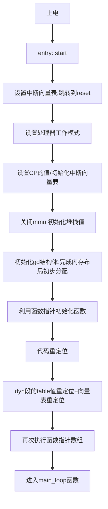

# 从头理清uboot（2）-启动流程分析

[toc]

## 1.总体流程图



## 2. 逐步分析

### 2.1 上电后执行的第一条指令

由于在编译的时候有下面的链接命令：

```shell
arm-linux-gnueabihf-ld.bfd   -pie  --gc-sections -Bstatic -Ttext 0x87800000 -o u-boot -T u-boot.lds arch/arm/cpu/armv7/start.o --start-group  arch/arm/cpu/built-in.o ...... test/dm/built-in.o --end-group arch/arm/lib/eabi_compat.o  -L /usr/lib/gcc-cross/arm-linux-gnueabihf/9 -lgcc -Map u-boot.map
```

所以其实是利用`u-boot.lds`来链接整个bin 文件的。那么就可以在lds 中看到uboot 的程序入口：

```shell
ENTRY(_start)
SECTIONS
{
 . = 0x00000000;
 . = ALIGN(4);
 .text :
 {
  *(.__image_copy_start)
  *(.vectors)
  arch/arm/cpu/armv7/start.o (.text*)
  *(.text*)
 }
```

在`arch/arm/lib/vector.s`中能够找到`_start`的具体实现：

```asm
_start:
#ifdef CONFIG_SYS_DV_NOR_BOOT_CFG
	.word	CONFIG_SYS_DV_NOR_BOOT_CFG
#endif
	b	reset
	ldr	pc, _undefined_instruction
	ldr	pc, _software_interrupt
	ldr	pc, _prefetch_abort
	ldr	pc, _data_abort
	ldr	pc, _not_used
	ldr	pc, _irq
	ldr	pc, _fiq
```

​		由此我们找到了程序上电执行的第一条指令。

### 2.2 初始化中断向量表

​		由上可知，_start的汇编代码的作用便是初始化了中断向量表，并且跳转像了`reset`函数。至于为什么这里实现了跳转了中断向量表，可先参考这个blog 学习：

https://www.cnblogs.com/liangliangge/p/12549087.html  

==TODO：补充armv7 中断处理功能==


### 2.3 初始化工作模式 & 初始化中断向量表。

​		在`_start`函数中，会跳到`reset`函数（在`arch/arm/cpu/armv7/start.s`）中，其函数如下：

```c
	.globl	reset
	.globl	save_boot_params_ret

reset:
	......//中间代码边分析边给出
	bl	_main
```

​		进入reset 之后，首先执行的就是`b  save_boot_params`但是又会跳回`save_boot_params_ret:`，在reset 中再次执行，由于定义是week 的，最后实际实现还可以再覆盖。见下方代码：

```c
ENTRY(save_boot_params)
	b	save_boot_params_ret
ENDPROC(save_boot_params)
	.weak	save_boot_params
```

​		之后便会初始化处理器的工作模式及关闭中断，见下方代码，注释已经写入其中。

https://blog.csdn.net/zhoutaopower/article/details/113746587

```c
	mrs	r0, cpsr			//读cpsr 的值到r0
	and	r1, r0, #0x1f		//取 低五位到r1
	teq	r1, #0x1a			//判断是，即判断是不是HYP模式
	bicne	r0, r0, #0x1f	//不是，就清除低五位
	orrne	r0, r0, #0x13	//不是，设置为SVC 模式
	orr	r0, r0, #0xc0		//关闭FIQ 和IRQ
	msr	cpsr,r0				//把新的r0 值写入CPSR
```

​		其次就会设置SCTLR 的值，这里会涉及到armv7 的CP 寄存器，可以见这篇文章：[协处理器CP15介绍—MCR/MRC指令(6) - 诺谦 - 博客园 (cnblogs.com)](https://www.cnblogs.com/lifexy/p/7203786.html)，uboot 汇编相关见下方注释：

```c
#if !(defined(CONFIG_OMAP44XX) && defined(CONFIG_SPL_BUILD))
	/* Set V=0 in CP15 SCTLR register - for VBAR to point to vector */
	mrc	p15, 0, r0, c1, c0, 0	//把cp15寄存器中c1控制位 读到r0中
	bic	r0, #CR_V				//清除r0 中的 CR_V 控制位，表示向量表地址为0x00000000,且可以重定位向量表。
	mcr	p15, 0, r0, c1, c0, 0	//把r0写回 cp15-c1

	/* Set vector address in CP15 VBAR register */
	ldr	r0, =_start
	mcr	p15, 0, r0, c12, c0, 0	 //把_start设置为向量表地址，写入 cp15-c12
#endif
```

### 2.4 cpu_init_cp15 & cpu_init_crit

​		在设置好中断向量表之后，在`reset `中会做两个**CPU 核**相关的init动作，之后便会跳转到`_main`执行，见下方代码：

```c
#ifndef CONFIG_SKIP_LOWLEVEL_INIT
	bl	cpu_init_cp15
	bl	cpu_init_crit
#endif
	bl	_main
```

我们依次分析这两个函数都做了什么事情：

#### 2.4.1 cpu_init_cp15 

​		通过下方代码，可以看出，功能为：关闭指令cache、清空写和预取缓存区，关闭mmu、使能地址跳转预测、获取CPU信息并且根据CPU info  信息的不同来做处理。下方直接将注释写入下方代码段中：

```asm
/*************************************************************************
 *
 * cpu_init_cp15
 *
 * Setup CP15 registers (cache, MMU, TLBs). The I-cache is turned on unless
 * CONFIG_SYS_ICACHE_OFF is defined.
 *
 *************************************************************************/
ENTRY(cpu_init_cp15)
	/*
	 * Invalidate L1 I/D
	 */
	mov	r0, #0			@ set up for MCR
	mcr	p15, 0, r0, c8, c7, 0	@ 无效整个数据和指令TLB
	mcr	p15, 0, r0, c7, c5, 0	@无效整个指令cache
	mcr	p15, 0, r0, c7, c5, 6	@ 无效整个跳转目标cache
	mcr p15, 0, r0, c7, c10, 4	@ 清空写缓存区
	mcr p15, 0, r0, c7, c5, 4	@ 清空预取缓存区

	/*
	 * disable MMU stuff and caches
	 */
	mrc	p15, 0, r0, c1, c0, 0	@把cp15-c1 的值读到r0中
	bic	r0, r0, #0x00002000	@ 设置低端一场中断向量表，且在可重定位状态
	bic	r0, r0, #0x00000007	@ 关闭mmu、地址对齐、禁止cache
	orr	r0, r0, #0x00000002	@ 使能地址对齐检查
	orr	r0, r0, #0x00000800	@ 使能跳转预测
#ifdef CONFIG_SYS_ICACHE_OFF
	bic	r0, r0, #0x00001000	@ 关闭 I-cahe
#else
	orr	r0, r0, #0x00001000	@ 使能 I-cahe
#endif
	mcr	p15, 0, r0, c1, c0, 0

#ifdef CONFIG_ARM_ERRATA_716044  --使能跳转预测
	mrc	p15, 0, r0, c1, c0, 0	@ read system control register
	orr	r0, r0, #1 << 11	@ set bit #11
	mcr	p15, 0, r0, c1, c0, 0	@ write system control register
#endif

  --C15 寄存器会随着设计的不同而不同。
#if (defined(CONFIG_ARM_ERRATA_742230) || defined(CONFIG_ARM_ERRATA_794072))
	mrc	p15, 0, r0, c15, c0, 1	@ read diagnostic register
	orr	r0, r0, #1 << 4		@ set bit #4
	mcr	p15, 0, r0, c15, c0, 1	@ write diagnostic register
#endif

 		.
 		. @中间为相似判断，省略
 		.
 		.
 		.
 		.

	mov	r5, lr			@ Store my Caller 保存下lr指针，保存函数返回地址
	mrc	p15, 0, r1, c0, c0, 0	@ 把cp15-c0-主标识符 读到r1
	mov	r3, r1, lsr #20		@ 将r1 右移20bit ,存储到r3
	and	r3, r3, #0xf		@获取r1[23:20]
	and	r4, r1, #0xf		@ 获取r1[4:0]
	mov	r2, r3, lsl #4		@ shift variant field for combined value
	orr	r2, r4, r2		@ r2= r1[23:20] + r1[4:0] = c0[23:20] + c0[4:0] CPU variant + revision

 		.
 		. @中间为相似判断，省略
 		.
 		.
 		.
 		.

#ifdef CONFIG_ARM_ERRATA_621766
	cmp	r2, #0x21		@ Only on < r2p1
	bge	skip_errata_621766

	mrc	p15, 0, r0, c1, c0, 1	@ Read ACR
	orr	r0, r0, #(0x1 << 5)	@ Set L1NEON bit
	push	{r1-r5}			@ Save the cpu info registers
	bl	v7_arch_cp15_set_acr
	pop	{r1-r5}			@ Restore the cpu info - fall through

skip_errata_621766:
#endif

	mov	pc, r5			@ 退出函数执行，跳回。
ENDPROC(cpu_init_cp15)
```


#### 2.4.1 cpu_init_crit 

​		跳入 `lowlevel_init`函数，在`arch/arm/cpu/armv7/lowlevel_init.s`中有定义，可见初步作用是初始化栈，调用`s_init`函数，定义在`arch/arm/cpu/armv7/mx6/soc.c`，但是对于`imax6ull`而言就是个空函数，故整体而言，这里只是做了一个获取`CONFIG_SYS_INIT_SP_ADDR`的值，做了下sp 的初始化，给`GD_SIZE`留出空间。

```asm
ENTRY(lowlevel_init)

	ldr	sp, =CONFIG_SYS_INIT_SP_ADDR
	bic	sp, sp, #7 /*8byte对齐*/
#ifdef CONFIG_SPL_DM
	mov	r9, #0
#else
#ifdef CONFIG_SPL_BUILD
	ldr	r9, =gdata
#else
	sub	sp, sp, #GD_SIZE  @减去 GD_SIZE 的值。
	bic	sp, sp, #7 /*8byte对齐*/
	mov	r9, sp
#endif
#endif
	push	{ip, lr} @将IP  和 lr  都压入栈中
	bl	s_init
	pop	{ip, pc} @将IP  和 lr  都出栈
ENDPROC(lowlevel_init)
```

​		对于`CONFIG_SYS_INIT_SP_ADDR`和``在`include/configs/mx6sllevk.h`中有定义：

```c
#define CONFIG_SYS_INIT_RAM_ADDR	IRAM_BASE_ADDR
#define CONFIG_SYS_INIT_RAM_SIZE	IRAM_SIZE

#define CONFIG_SYS_INIT_SP_OFFSET \
	(CONFIG_SYS_INIT_RAM_SIZE - GENERATED_GBL_DATA_SIZE)
#define CONFIG_SYS_INIT_SP_ADDR \
	(CONFIG_SYS_INIT_RAM_ADDR + CONFIG_SYS_INIT_SP_OFFSET)
```

​		其中`IRAM_BASE_ADDR`和 `IRAM_SIZE`在``arch/arm/include/asm/arch-mx6/imx-regs.h`中有定义,可以看出，这应该是CPU内部的**ram**：

```c
#define IRAM_BASE_ADDR			0x00900000
#if !(defined(CONFIG_MX6SX) || defined(CONFIG_MX6UL) || \
	defined(CONFIG_MX6SLL) || defined(CONFIG_MX6SL))
#define IRAM_SIZE                    0x00040000
#else
#define IRAM_SIZE                    0x00020000
#endif
```

​		我们还需要知道`GENERATED_GBL_DATA_SIZE`和`GD_SIZE`的值，都定义在`include/generated/generic-asm-offsets.h`中，有以下定义：

```c
#define GENERATED_GBL_DATA_SIZE 256 /* (sizeof(struct global_data) + 15) & ~15	@ */
#define GENERATED_BD_INFO_SIZE 80 /* (sizeof(struct bd_info) + 15) & ~15	@ */
#define GD_SIZE 248 /* sizeof(struct global_data)	@ */
#define GD_BD 0 /* offsetof(struct global_data, bd)	@ */
#define GD_MALLOC_BASE 188 /* offsetof(struct global_data, malloc_base)	@ */
#define GD_RELOCADDR 44 /* offsetof(struct global_data, relocaddr)	@ */
#define GD_RELOC_OFF 64 /* offsetof(struct global_data, reloc_off)	@ */
#define GD_START_ADDR_SP 60 /* offsetof(struct global_data, start_addr_sp)	@ */
```

​		由此我们可以得到当前的栈指针的值：

```markdown
* sp = CONFIG_SYS_INIT_SP_ADDR =  (CONFIG_SYS_INIT_RAM_ADDR + CONFIG_SYS_INIT_RAM_SIZE - GENERATED_GBL_DATA_SIZE) = 0x00900000 + 0x00020000 -256 = 0x0091FF00
* sp = sp - GD_SIZE = 0x0091FF00 - 248 = 0x0091FE08 
* bic	sp, sp, #7 --> sp = 0x0091FE00
```

### 2.5 进入_main 函数

​		==补充重点：==**建议看crt0.S 中关于_main 函数的作用，里面解释了为什么会有这些流程**

​		在上面步骤，应该是初步完成了CPU的一些配置，解下来会进入_main函数，进一步完成///////   `__main`函数定义在` arch/arm/lib/crt0.S`中。

​	首先判断是否定义了SPL build 相关，初始化栈sp 指针。然后会分别调用`board_init_f_alloc_reserve`、`board_init_f_init_reserve`、`board_init_f`(r0 ==0),可见下方代码：

```asm
ENTRY(_main)
/*
 * Set up initial C runtime environment and call board_init_f(0).
 */
#if defined(CONFIG_SPL_BUILD) && defined(CONFIG_SPL_STACK)
	ldr	sp, =(CONFIG_SPL_STACK)
#else
	ldr	sp, =(CONFIG_SYS_INIT_SP_ADDR)
#endif
#if defined(CONFIG_CPU_V7M)	/* v7M forbids using SP as BIC destination */
	mov	r3, sp
	bic	r3, r3, #7
	mov	sp, r3
#else
	bic	sp, sp, #7	/* 8-byte alignment for ABI compliance */
#endif
	mov	r0, sp
	bl	board_init_f_alloc_reserve
	mov	sp, r0  
	/* set up gd here, outside any C code */
	mov	r9, r0
	bl	board_init_f_init_reserve

	mov	r0, #0
	bl	board_init_f

#if ! defined(CONFIG_SPL_BUILD)

/*
 * Set up intermediate environment (new sp and gd) and call
 * relocate_code(addr_moni). Trick here is that we'll return
 * 'here' but relocated.
 */

	ldr	sp, [r9, #GD_START_ADDR_SP]	/* sp = gd->start_addr_sp */
	.......
```

#### 2.5.1 board_init_f_alloc_reserve（sp）

​	其中调用的`board_init_f_alloc_reserve（sp）`在`common/init/board_init.c`中，这个函数有一个传参，实际为sp 的值，可见这个函数的作用为在栈中留出`CONFIG_SYS_MALLOC_F_LEN = 0x400`大小和`global_data`结构体的大小(GD_SIZE)空间区域后，进行一个16byte 的对齐操作。

```c
ulong board_init_f_alloc_reserve(ulong top)
{
	/* Reserve early malloc arena */
#if defined(CONFIG_SYS_MALLOC_F)
	top -= CONFIG_SYS_MALLOC_F_LEN;
#endif
	/* LAST : reserve GD (rounded up to a multiple of 16 bytes) */
	top = rounddown(top-sizeof(struct global_data), 16);
	return top;
}
```

​		所以当前的sp 为：`0x0091FF00 - 0x400 - 248 = 0x0091Fa00 `。出栈后会把**算好的r0 在赋值给sp**，同时赋值g给r9。

#### 2.5.2 board_init_f_init_reserve（sp）

​	之后会调用`board_init_f_init_reserve`，对于imax6ull 条件编译之后见下方，可见主要作用为：

​		将当前sp 设置为`global_data`的基地址、`global_data`区域清0、然后把`gd->malloc_base`设置为base 加上``struct global_data``并且16字节取整，之后base 加上`CONFIG_SYS_MALLOC_F_LEN`长度。那么这个函数就是把`global_data`初始化了，把malloc地址指向了` 0x0091FF00 - 0x400`，然后把base设置为了`0x0091FF00 `再赋值给r0了。

​		作用：这里留出一块内存用于保存global_data和 执行后面的函数的内存空间

```c
void board_init_f_init_reserve(ulong base)
{
	struct global_data *gd_ptr;
	/*
	 * clear GD entirely and set it up.
	 * Use gd_ptr, as gd may not be properly set yet.
	 */
	gd_ptr = (struct global_data *)base;
	/* zero the area */
#ifdef _USE_MEMCPY
	memset(gd_ptr, '\0', sizeof(*gd));
	/* next alloc will be higher by one GD plus 16-byte alignment */
	base += roundup(sizeof(struct global_data), 16);
	/*
	 * record early malloc arena start.
	 * Use gd as it is now properly set for all architectures.
	 */
#if defined(CONFIG_SYS_MALLOC_F)
	/* go down one 'early malloc arena' */
	gd->malloc_base = base;
	/* next alloc will be higher by one 'early malloc arena' size */
	base += CONFIG_SYS_MALLOC_F_LEN;
#endif
}
```

#### 2.5.3 board_init_f(0)

​	`board_init_f`函数定义在` common/board_f.c`中，经过条件编译之后的结果为下图所示：

```c
void board_init_f(ulong boot_flags)
{
	gd->flags = boot_flags;
	gd->have_console = 0;  
	if (initcall_run_list(init_sequence_f))
		hang();
#if !defined(CONFIG_ARM) && !defined(CONFIG_SANDBOX) && \
		!defined(CONFIG_EFI_APP)
	/* NOTREACHED - jump_to_copy() does not return */
	hang();
#endif
	/* Light up LED1 */
	imx6_light_up_led1();
}
```

​		`gd->have_console = 0;`表明现在还没有窗口。

​		其中`boot_flags == 0`作为输入传入，后续主要是执行`initcall_run_list(init_sequence_f)`这个函数，我们需要先看函数输入`init_sequence_f`的定义(已经经过条件编译，见下方)。

​		其中`init_fnc_t`的定义为`typedef int (*init_fnc_t)(void);`，由此这是一个函数指针结构体，而在`board_init_f`中调用的`initcall_run_list`函数就是会遍历执行下方的`init_sequence_f`函数结构体，来执行板级的初始化。对于被遍历的函数，大致功能见注释。

```c
static init_fnc_t init_sequence_f[] = {
    setup_mon_len, //gd->mon_len = (ulong)&__bss_end - (ulong)_start; 设置mon_len 为代码长度
    initf_malloc,	//gd->malloc_limit = 0x40; 当前内存池大小。
	initf_console_record,	//return 0;
    arch_cpu_init,		/* basic arch cpu dependent setup */
	initf_dm,			//初始化驱动模型相关
	arch_cpu_init_dm,
	mark_bootstage,		/* need timer, go after init dm */
#if defined(CONFIG_BOARD_EARLY_INIT_F)
	board_early_init_f,		//，I.MX6ULL 用来初始化串口的 IO 配置
#endif
#if defined(CONFIG_ARM) || defined(CONFIG_MIPS) || \
		defined(CONFIG_BLACKFIN) || defined(CONFIG_NDS32) || \
		defined(CONFIG_SPARC)
	timer_init,		//初始化内部定时器
#endif    
#if defined(CONFIG_BOARD_POSTCLK_INIT)
	board_postclk_init,		//设置 VDDSOC 电压
#endif
#if defined(CONFIG_SYS_FSL_CLK) || defined(CONFIG_M68K)
	get_clocks,			//可以配置获取多种时钟值，I.MX6ULL 获取的是 sdhc_clk 时钟
#endif
	env_init,		//gd->env_addr	= (ulong)&default_environment[0]; 设置gd ENV 地址
    init_baud_rate,		/* 根据 “baudrate” 环境变量配置波特率 */
	serial_init,		/* 串口初始化 会调用函数指针 */
	console_init_f,		/* gd->have_console = 1; 配置输出窗口*/
    display_options,	/* 在窗口上显示输出 */
	display_text_info,	/* 在窗口上打印文本输出*/
	print_cpuinfo,		/* 打印CPU 信息 */      
#if defined(CONFIG_DISPLAY_BOARDINFO)
	show_board_info,	/* 打印板子 信息 */    
#endif
	INIT_FUNC_WATCHDOG_INIT     /*初始化看门狗， I.MX6ULL 来说是空函数  */
	INIT_FUNC_WATCHDOG_RESET 	/*喂狗， I.MX6ULL 来说是空函数  */
#if defined(CONFIG_HARD_I2C) || defined(CONFIG_SYS_I2C)
	init_func_i2c,				/* 初始化IIC */
#endif        
	announce_dram_init,
	/* TODO: unify all these dram functions? */
#if defined(CONFIG_ARM) || defined(CONFIG_X86) || defined(CONFIG_NDS32) || \
		defined(CONFIG_MICROBLAZE) || defined(CONFIG_AVR32)
	dram_init,		/*gd->ram_size = imx_ddr_size();把 外部能用的DDR大小付给gd->ram_size */
#endif    
    INIT_FUNC_WATCHDOG_RESET
    INIT_FUNC_WATCHDOG_RESET
    INIT_FUNC_WATCHDOG_RESET
 	setup_dest_addr,	/* 这个函数下方详细介绍 */
   	reserve_round_4k,	/* gd->relocaddr &= ~(4096 - 1);重定位地址4k 对齐 */
#if !(defined(CONFIG_SYS_ICACHE_OFF) && defined(CONFIG_SYS_DCACHE_OFF)) && \
		defined(CONFIG_ARM)
	reserve_mmu,		/* 这个函数下方详细介绍 */
#endif
   	reserve_trace,		/*留出debug 空间，I.MX6ULL 来说是空函数*/
#if !defined(CONFIG_BLACKFIN)
	reserve_uboot,		/*留出 uboot code空间 */
#endif
#ifndef CONFIG_SPL_BUILD
	reserve_malloc,		/*留出malloc 空间 TOTAL_MALLOC_LEN*/
	reserve_board,		/* 留出 sizeof(bd_t) 的空间*/
#endif
	setup_machine,		/* 设置机器id 等设置，I.MX6ULL 来说是空函数 */
	reserve_global_data,	/*留出sizeof(gd_t)的空间 */
	reserve_fdt,		/* 留出 fdt_size 的空间,I.MX6ULL 无效 */
	reserve_arch,		/* I.MX6ULL 来说是空函数 */
	reserve_stacks,		/*gd->start_addr_sp 栈顶做16字节对齐  */
	setup_dram_config,	/* 设置Dram的地址和大小，后续告诉linux 内核 */
	show_dram_config,	/* 打印上述信息  */
	display_new_sp,    	/* 打印sp-栈顶 */
   	INIT_FUNC_WATCHDOG_RESET	
	reloc_fdt,			/* I.MX6ULL 没有用到 */
重要：setup_reloc,		/*设置一些重定位要用的参数，并且将gd 从ram中拷贝到DDR中* / 
    	NULL,
};
```

可以看出，`board_init_f(0)`总体上是围绕`global_data`展开的，关于`global_data`可以参考这篇文档：https://blog.csdn.net/wenjin359/article/details/82849492，

* setup_dest_addr 函数

  * 作用：初始化`gd->ram_siz`、`gd->ram_top`、`gd->relocaddr `。

	 ```c
  static int setup_dest_addr(void)
  {
  	gd->ram_size = board_reserve_ram_top(gd->ram_size);// ram_szie 前面已经init过了，是imx_ddr_size()
  #ifdef CONFIG_SYS_SDRAM_BASE
  	gd->ram_top = CONFIG_SYS_SDRAM_BASE;	//设置为DDR base 地址CONFIG_SYS_SDRAM_BASE
  #endif
  	gd->ram_top += get_effective_memsize();// base + gd->ram_size 
  	gd->ram_top = board_get_usable_ram_top(gd->mon_len);
  	gd->relocaddr = gd->ram_top;			//重定位地址 = gd->ram_top
  	debug("Ram top: %08lX\n", (ulong)gd->ram_top);
  	return 0;
  }
   ```


* reserve_round_4k 函数，把刚刚初始化的`gd->relocaddr`地址4K对齐。`gd->relocaddr &= ~(4096 - 1);`

* reserve_mmu:

  * 作用：在DDR中留出`PGTABLE_SIZE`大小的空间用于做tlb。

  ```c
  static int reserve_mmu(void)
  {
  	/* reserve TLB table */
  	gd->arch.tlb_size = PGTABLE_SIZE;
  	gd->relocaddr -= gd->arch.tlb_size;
  
  	/* round down to next 64 kB limit */
  	gd->relocaddr &= ~(0x10000 - 1);
  
  	gd->arch.tlb_addr = gd->relocaddr;
  	debug("TLB table from %08lx to %08lx\n", gd->arch.tlb_addr,
  	      gd->arch.tlb_addr + gd->arch.tlb_size);
  	return 0;
  }
  ```

* ==reserve_uboot：==

  * 作用：留出code_len 的空间，并且把此时`relocaddr`地址付给`start_addr_sp`。**注意，这里开始gd->relocaddr**不再继续减小了，因为已经到了代码段都拷完的地方了，重定位的地址已经确定好了！！！

    ```c
    static int reserve_uboot(void)
    {
    	gd->relocaddr -= gd->mon_len;
    	gd->relocaddr &= ~(4096 - 1);
    
    	debug("Reserving %ldk for U-Boot at: %08lx\n", gd->mon_len >> 10,
    	      gd->relocaddr);
    
    	gd->start_addr_sp = gd->relocaddr;
    
    	return 0;
    }
    ```

* 其余剩余的reserve_xxx 函数都是在DDR 内存中，划分出对应区域给对应功能实用。有以下几个参数需要注意一下

  * 重定位offset 偏移：`gd->reloc_off = gd->relocaddr - CONFIG_SYS_TEXT_BASE;`

  * 会有一次gd 的搬运：，其中gd 的宏定义展开见下方，由于之前将**将cpu ram 的gd 指针存储在R9**中，所以芯片内部的ram 中有一份global_data结构体。新的gd 会放在全局变量后面：参考`reserve_global_data`函数

    ```c
    //搬运：
    `memcpy(gd->new_gd, (char *)gd, sizeof(gd_t));`
    //获取老gd 地址：
    __asm__ volatile("mov %0, r9\n" : "=r" (gd_ptr));
    //新GD 地址
     gd->new_gd = (gd_t *)map_sysmem(gd->start_addr_sp, sizeof(gd_t));
       
    
    
    ```

* 总结：由此 board_info 就执行完了，主要是初始化了DDR的内存布局，并且对golobal data 进行初始化，同时拷贝进了DDR中。

####  2.5.4 再次回到 _main 函数

执行完DDR区域分配及配置好gd 之后，会执行下面的操作：

* 把 sp设置到DDR上：`ldr   sp, [r9, #GD_START_ADDR_SP] /* sp = gd->start_addr_sp */`

*  初始化栈，之后会执行代码段的重定位，需要注意`lr`的值，再次返回时就已经到DDR中的重定位地址了。

  * 问题：当前代码在什么地址？**R:**根据obj dump 来看，在`87802800 <_main>:`DDR 中。
  * ==追问：==那为什么需要再搬运一次地址？新搬运的地址在哪里？**R:**搬运的地址是`board_init_f()`中设置的地址，提高了灵活性？
  
  ```c
  #if defined(CONFIG_CPU_V7M)	/* v7M forbids using SP as BIC destination */
  	mov	r3, sp
  	bic	r3, r3, #7
  	mov	sp, r3
  #else
  	bic	sp, sp, #7	/* 8-byte alignment for ABI compliance */
  #endif
  	ldr	r9, [r9, #GD_BD]		/* r9 = gd->bd */
  	sub	r9, r9, #GD_SIZE		/* new GD is below bd */ 获取新gd的位置？
  
  	adr	lr, here
  	ldr	r0, [r9, #GD_RELOC_OFF]		/* r0 = gd->reloc_off */
  	add	lr, lr, r0				  lr  = here 地址 + gd->reloc_off 
  #if defined(CONFIG_CPU_V7M)
  	orr	lr, #1				/* As required by Thumb-only */
  #endif
  	ldr	r0, [r9, #GD_RELOCADDR]		/* r0 = gd->relocaddr */
  	b	relocate_code			/*代码从定位*/ 所以执行完这个，跳回的时候就已经在DDR中了？
  here:
  /*
   * now relocate vectors
   */
  	bl	relocate_vectors 	 
  /* Set up final (full) environment */
	bl	c_runtime_cpu_setup	/* we still call old routine here */
  #endif
  ```
  
* 执行`relocate_code`函数

  ​		见下方代码，r1是代码段起始地址，r0是传入的`gd->relocaddr`重定位地址，整体作用是判断起始地址和`relocaddr`是否相等，不相等的话就会进行代码段的搬运（__image_copy_start ~ image_copy_end）。然后进行`dyn`段，即动态代码段的符号表地址的更改。【此处涉及到elf文件的表示，有兴趣的可以查阅elf 文件格式，了解动态代码是如何执行的。】

  **注意：**这里跳转使用的是`b`而不是**bl**就是不需要更改**LR**的值，因为LR 已经被重定位了。

  ```asm
  ENTRY(relocate_code)
  	ldr	r1, =__image_copy_start	/* r1 <- SRC &__image_copy_start */
  	subs	r4, r0, r1		/* r4 <- relocation offset */
  	beq	relocate_done		/* skip relocation */
  	ldr	r2, =__image_copy_end	/* r2 <- SRC &__image_copy_end */
  
  copy_loop:
  	ldmia	r1!, {r10-r11}		/* copy from source address [r1]    */
  	stmia	r0!, {r10-r11}		/* copy to   target address [r0]    */
  	cmp	r1, r2			/* until source end address [r2]    */
  	blo	copy_loop
  
  	/*
  	 * fix .rel.dyn relocations
  	 */
  	ldr	r2, =__rel_dyn_start	/* r2 <- SRC &__rel_dyn_start */
  	ldr	r3, =__rel_dyn_end	/* r3 <- SRC &__rel_dyn_end */
  fixloop:
  	ldmia	r2!, {r0-r1}		/* (r0,r1) <- (SRC location,fixup) */
  	and	r1, r1, #0xff
  	cmp	r1, #23			/* relative fixup? */
  	bne	fixnext
  
  	/* relative fix: increase location by offset */
  	add	r0, r0, r4
  	ldr	r1, [r0]
  	add	r1, r1, r4
  	str	r1, [r0]
  fixnext:
  	cmp	r2, r3
  	blo	fixloop
  
  relocate_done:
  	bx	lr
  ENDPROC(relocate_code)
  ```

* 向量表的重定位：

  由于`arm`处理器将向量表放在代码头部，所以这里中断向量表的重定位也是设置 cp15-c12 的值，将其设置为`gd->relocaddr`，即重定位代码段的首地址。编译后的程序如下所示：

  ```asm
  ENTRY(relocate_vectors)	
  	ldr	r0, [r9, #GD_RELOCADDR]	/* r0 = gd->relocaddr */
  	mcr     p15, 0, r0, c12, c0, 0  /* Set VBAR */
  	bx	lr
  ENDPROC(relocate_vectors)	
  ```

* 执行`c_runtime_cpu_setup 函数`，此代码在`arch/arm/cpu/armv7/start.S `中，作用是关闭指令cache

* 执行清除BSS段的汇编代码

* 跳转执行到`board_init_r()`，至此**—main**函数运行结束。


### 2.6 执行board_init_r函数，开始最后的初始化

board_init_r函数如下，如同board_init_f 函数，主要是遍历了`init_sequence_r`这样一个函数指针结构提。

```asm
void board_init_r(gd_t *new_gd, ulong dest_addr)
{
	if (initcall_run_list(init_sequence_r))
		hang();
	/* NOTREACHED - run_main_loop() does not return */
	hang();
}
```

同样，对于`init_sequence_r`这样一个函数指针数据，我们分析其条件条件编译之后的参数项

```c
init_fnc_t init_sequence_r[] = {
	initr_trace,
	initr_reloc,
	/* TODO: could x86/PPC have this also perhaps? */
#ifdef CONFIG_ARM
	initr_caches,
#endif
	initr_reloc_global_data,
	initr_barrier,
	initr_malloc,
	initr_console_record,
	bootstage_relocate,
#ifdef CONFIG_DM
	initr_dm,
#endif
	initr_bootstage,
#if defined(CONFIG_ARM) || defined(CONFIG_NDS32)
	board_init,	/* Setup chipselects */
#endif
	stdio_init_tables,
	initr_serial,
	initr_announce,
	INIT_FUNC_WATCHDOG_RESET    
	power_init_board,        
#ifdef CONFIG_GENERIC_MMC
	initr_mmc,
#endif
    initr_env,
   	INIT_FUNC_WATCHDOG_RESET
	initr_secondary_cpu,
   	stdio_add_devices,
	initr_jumptable,
    interrupt_init,
#if defined(CONFIG_ARM) || defined(CONFIG_AVR32)
	initr_enable_interrupts,
#endif
    #ifdef CONFIG_CMD_NET
	initr_ethaddr,
#endif
#ifdef CONFIG_BOARD_LATE_INIT
	board_late_init,
#endif
#ifdef CONFIG_CMD_NET
	INIT_FUNC_WATCHDOG_RESET
	initr_net,
#endif
        imx6_light_up_led2,

	run_main_loop,
};       
```


